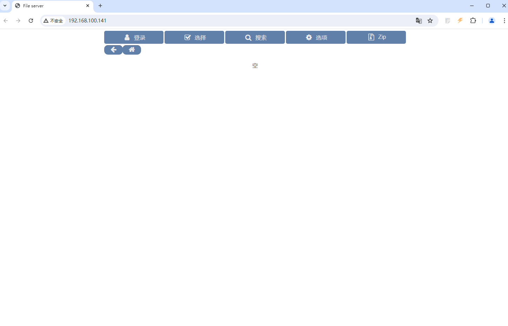

# CVE-2024-39943

> **Create by：** A-little-dragon
>
> **Team：** TracelessSec
>
> **漏洞描述：** HFS3 远程命令执行漏洞


# **0x01 漏洞描述**

Rejetto HFS（又名HTTP文件服务器）在Linux、UNIX和macOS上的版本低于0.52.10存在一个漏洞，允许远程认证用户执行操作系统命令（如果他们拥有上传权限）。这是因为使用shell来执行df命令，具体是在Node.js的child_process中使用execSync而不是spawnSync来执行命令。

# 0x02 影响范围

`Rejetto HTTP File Server 3 在Linux、UNIX和macOS上的版本低于0.52.10存在一个漏洞`

# 0x03 FOFA语法

```
title=="File Server"
```

# 0x04 前置条件

要想利用此漏洞至少要满足三个条件：

1. 目标版本符合漏洞存在版本

2. 需要具有认证用户的cookie
3. 该认证用户具有上传权限

# 0x05 环境搭建

下载地址：[https://github.com/rejetto/hfs/releases/tag/v0.52.9](https://github.com/rejetto/hfs/releases/tag/v0.52.9)

下载命令

```python
wget https://github.com/rejetto/hfs/releases/download/v0.52.9/hfs-linux.zip
```

解压后运行

```bash
sudo iptables -F
```

创建config.yaml

```python
localhost_admin: false
accounts:
    admin:
        password: hello123
        admin: true
    frank:
        password: another
        belongs: group1
    guest:
        password: guest
    group1:
```

执行下列命令

```python
sudo ./hfs --config config.yaml
```

运行后 访问`your-ip:80`端口即可



登陆后台

后台地址：`your-ip/~/admin/`


默认账号/密码：`admin/hello123`


# 0x06 漏洞利用

攻击机设置监听端口

```bash
nc -lvvp 9999
```


获取登陆后的cookie

> 注意：cookie需要登陆后才能获取
> 


下载利用脚本：[https://github.com/A-little-dragon/CVE-2024-39943-Exploit](https://github.com/A-little-dragon/CVE-2024-39943-Exploit)

执行脚本

```bash
python3 CVE-2024-39943.py
```


