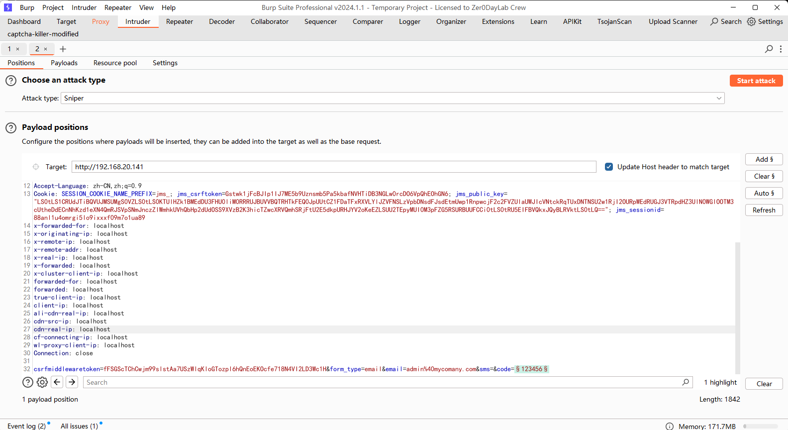

# CVE-2023-43650

> **Created by：** A-little-dragon
>
> **Team：** TracelessSec
>
> **漏洞描述：** 重置密码Token可爆破漏洞


## **0x01 漏洞描述**

由于重置用户密码的验证码没有速率限制，未经身份验证的远程攻击者可通过请求重置密码，爆破收到的6位验证码来实现劫持非MFA帐户。

## **0x02 利用范围**

```json
2.0.0 <= JumpServer < 2.28.19
3.0.0 <= JumpServer < 3.7.0
# 2.27与3.1.0均测试失败
```

## **0x03 漏洞复现**

直接bp抓登录包爆破就行！



