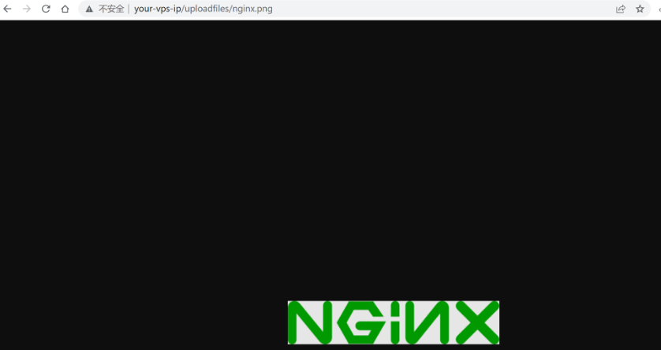
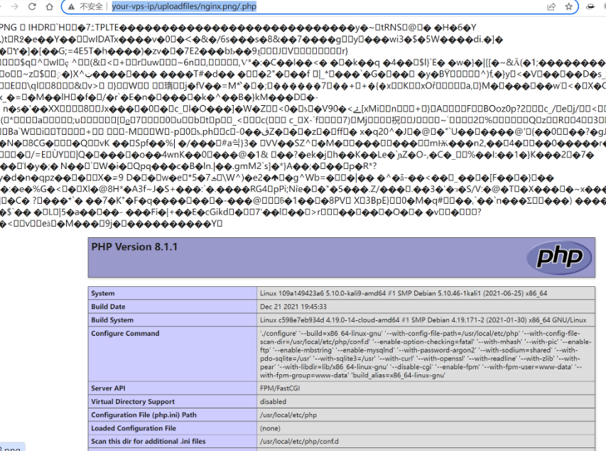
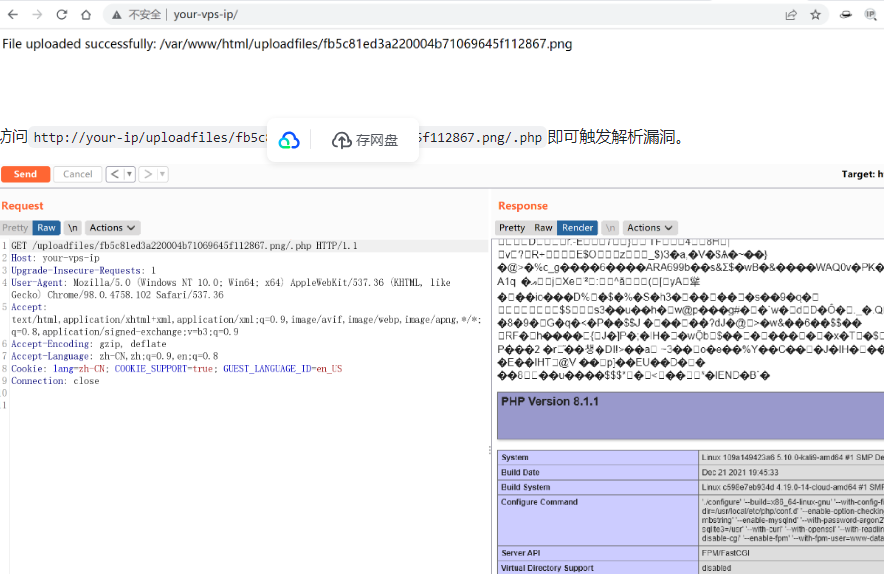

# CVE-2019-7238

> **Created by：** A-little-dragon
>
> **Team：** TracelessSec
>
> **漏洞描述：** Nginx 解析漏洞


## 0x01 漏洞描述

版本信息：

- Nginx 1.x 最新版
- PHP 7.x最新版

该漏洞与Nginx、php版本无关，属于用户配置不当造成的解析漏洞。

## 0x02 漏洞原理

1、 由于nginx.conf的如下配置导致nginx把以’.php’结尾的文件交给fastcgi处理,为此可以构造http://ip/uploadfiles/test.png/.php (url结尾不一定是‘.php’,任何服务器端不存在的php文件均可,比如’a.php’),其中test.png是我们上传的包含PHP代码的照片文件。

## 0x03 环境搭建

正常界面



增加`/.php`后缀，被解析成PHP文件：



访问`http://your-ip/index.php`可以测试上传功能，上传代码不存在漏洞，但利用解析漏洞即可getshell。

图片马生成命令：

```text
copy 1.jpg/b+1.php/a 2.jpg
```

Vulhub镜像上传图片之前需要赋予`/var/www/html`目录写入权限。


