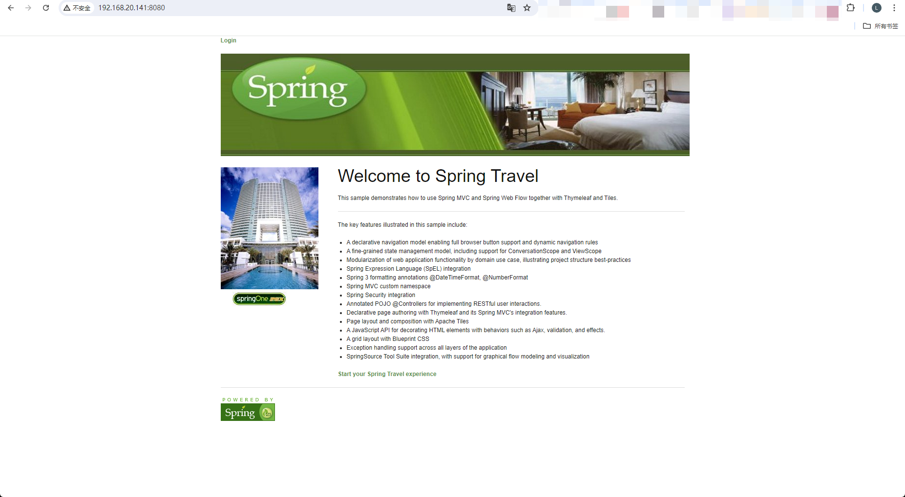

# CVE-2017-4971

> **Created by：** A-little-dragon
>
> **Team：** TracelessSec
>
> **漏洞描述：** Spring WebFlow 远程代码执行漏洞


# 0x01 漏洞描述

Spring WebFlow 是一个适用于开发基于流程的应用程序的框架（如购物逻辑），可以将流程的定义和实现流程行为的类和视图分离开来。在其 2.4.x 版本中，如果我们控制了数据绑定时的field，将导致一个SpEL表达式注入漏洞，最终造成任意命令执行。

# 0x02 影响范围

2.4.x 

# 0x03 环境搭建

使用vulhub快速搭建漏洞环境

```bash
cd vulhub/spring/CVE-2017-4971
docker compose up -d
```

访问`http://your-ip:8080`，将看到一个酒店预订的页面，这是spring-webflow官方给的简单示例



# 0x04 漏洞复现

首先访问`http://your-ip:8080/login`，用页面左边给出的任意一个账号/密码登录系统


然后访问id为1的酒店`http://your-ip:8080/hotels/1`，点击预订按钮“Book Hotel”，填写相关信息后点击“Process”（从这一步，其实WebFlow就正式开始了）


再点击确认“Confirm”：


此时抓包，抓到一个POST数据包，我们向其中添加一个字段（也就是反弹shell的POC）

（注意：别忘记URL编码）


成功执行，获得shell：

