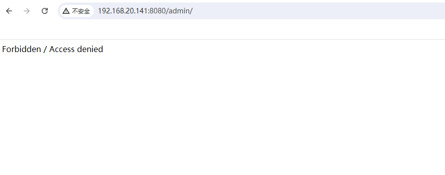

# CVE-2022-22978

> **Created by：** A-little-dragon
>
> **Team：** TracelessSec
>
> **漏洞描述：** Spring-security身份绕过漏洞


# 0x01 漏洞介绍

CVE-2022-22978，是一个Spring-security身份绕过漏洞

当Spring-security使用 `RegexRequestMatcher` 进行权限配置，由于`RegexRequestMatcher`正则表达式配置权限的特性，正则表达式中包含“.”时，未经身份验证攻击者可以通过构造恶意数据包绕过身份认证。

# 0x02 影响范围

在 Spring Security 版本 5.5.6 和 5.6.3 以及更早的不受支持的版本中，RegexRequestMatcher 很容易被错误配置，从而被某些 servlet 容器绕过。

# **0x03 环境搭建**

使用vulhub快速搭建环境

```bash
cd vulhub/spring/CVE-2022-22978
docker compose up -d
```



# **0x04 漏洞复现**

payload：`/admin/index%0a`

